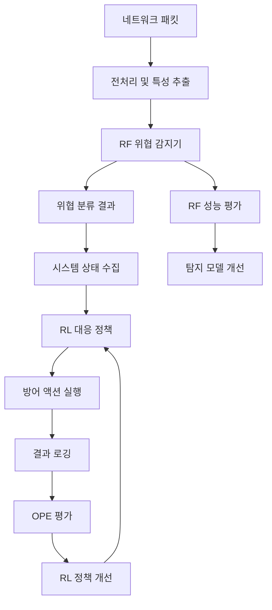

# IPS 시스템 파이프라인 재설계

## 현재 구조 문제점

### 기존 파이프라인 (문제가 있는 구조)
```
패킷 수집 → [RF + RL 동시 탐지] → 즉석 대응
```

**문제점:**
1. RF와 RL이 동일한 탐지 작업 중복 수행
2. RL이 RF 결과를 정답으로 사용 (순환 참조)
3. 개별 패킷마다 RL 추론 (비효율)
4. 시스템 컨텍스트 고려 부족
5. 평가 지표 혼재 (탐지 vs 대응)

## 새로운 파이프라인 설계

### 2단계 파이프라인 (개선된 구조)
```
1단계: 감지기 (Supervised Learning - RF)
패킷 수집 → 전처리 → RF 모델 → 위협 분류 + 신뢰도

2단계: 정책 (Reinforcement Learning)  
RF 결과 + 시스템 상태 → RL 에이전트 → 최적 대응 액션
```

## 상세 설계

### 1단계: 감지기 (RF)

#### **입력 데이터**
```python
packet_features = {
    'basic_features': ['source', 'destination', 'protocol', 'length', 'ttl', 'flags'],
    'session_features': ['session_duration', 'packet_count', 'byte_rate'],
    'temporal_features': ['time_of_day', 'day_of_week'],
    'context_features': ['src_ip_reputation', 'geo_location']
}
```

#### **출력 데이터**
```python
rf_output = {
    'threat_probability': 0.85,        # 위협 확률 (0.0-1.0)
    'confidence_score': 0.92,          # 예측 신뢰도
    'threat_category': 'port_scan',     # 공격 유형
    'severity_level': 'high',          # 심각도 (low/medium/high)
    'feature_importance': {...},       # 주요 특성 기여도
    'calibrated_probability': 0.83     # 보정된 확률
}
```

#### **평가 지표**
```python
rf_evaluation_metrics = {
    'classification_performance': {
        'pr_auc': 0.87,                # PR-AUC (클래스 불균형 대응)
        'mcc': 0.75,                   # Matthews Correlation Coefficient
        'balanced_accuracy': 0.82,     # 균형 정확도
        'fpr_at_tpr_90': 0.05,        # TPR 90%에서의 FPR
        'tpr_at_fpr_001': 0.78         # FPR 0.1%에서의 TPR
    },
    'operational_performance': {
        'detection_latency_mean': 85,   # 평균 탐지 지연 (ms)
        'detection_latency_95p': 150,  # 95퍼센타일 지연
        'calibration_error': 0.08,     # 보정 오차 (Brier score)
        'reliability_curve': {...}     # 신뢰도 곡선
    },
    'generalization': {
        'cross_dataset_auc': 0.79,     # 다른 데이터셋 성능
        'novel_attack_detection': 0.65 # 미지 공격 탐지율
    }
}
```

### 2단계: 정책 (RL)

#### **상태 공간 (State Space)**
```python
rl_state = {
    'threat_info': {
        'rf_probability': 0.85,        # RF 예측 확률
        'confidence': 0.92,            # RF 신뢰도
        'threat_type': 'port_scan',    # 공격 유형
        'severity': 'high'             # 심각도
    },
    'system_state': {
        'cpu_usage': 45.2,             # CPU 사용률
        'memory_usage': 78.5,          # 메모리 사용률
        'active_connections': 1247,     # 활성 연결 수
        'blocked_ips_count': 23        # 현재 차단된 IP 수
    },
    'session_context': {
        'src_ip_history': 'clean',     # 소스 IP 이력
        'connection_pattern': 'normal', # 연결 패턴
        'time_pattern': 'business_hour' # 시간 패턴
    },
    'business_context': {
        'service_criticality': 'high', # 서비스 중요도
        'user_impact': 'medium',       # 사용자 영향도
        'compliance_requirement': True # 규정 준수 요구사항
    }
}
```

#### **액션 공간 (Action Space)**
```python
rl_actions = {
    0: 'allow',           # 허용 (정상 트래픽 처리)
    1: 'block_temporary', # 임시 차단 (30분)
    2: 'block_permanent', # 영구 차단
    3: 'rate_limit',      # 레이트 제한 적용
    4: 'deep_inspection', # 추가 검사 수행
    5: 'isolate_session'  # 세션 격리
}
```

#### **보상 함수 설계**
```python
def calculate_defense_reward(action, threat_info, outcome, costs):
    """대응 정책 보상 계산"""
    
    base_reward = 0
    
    # 1. 탐지 정확성 보상
    if outcome['is_true_positive']:
        base_reward += costs['attack_prevention_value']  # +R (사고 비용 절감)
    elif outcome['is_false_positive']:
        base_reward -= costs['false_positive_cost']      # -α (운영 불편 비용)
    
    # 2. 대응 적절성 보상
    threat_level = threat_info['severity']
    if threat_level == 'high' and action in [1, 2]:    # 고위험에 강한 대응
        base_reward += 5.0
    elif threat_level == 'low' and action in [0, 4]:   # 저위험에 관찰적 대응
        base_reward += 3.0
    elif threat_level == 'medium' and action in [3, 4]: # 중위험에 제한적 대응
        base_reward += 4.0
    else:
        base_reward -= 2.0  # 부적절한 대응
    
    # 3. 시스템 영향 고려
    if action in [2, 5] and costs['system_load'] > 0.8:  # 고부하시 강한 조치
        base_reward -= costs['system_impact_penalty']     # -β (리소스 비용)
    
    # 4. 지연 페널티
    response_delay = outcome['response_time_ms']
    if response_delay > 1000:  # 1초 초과 지연
        base_reward -= costs['latency_penalty'] * (response_delay / 1000)  # -γ·delay
    
    return base_reward

# 비용 매개변수 (조직 정책에 따라 조정 가능)
cost_parameters = {
    'attack_prevention_value': 100.0,   # 공격 차단 가치
    'false_positive_cost': 20.0,        # 오탐 비용
    'system_impact_penalty': 10.0,      # 시스템 영향 페널티
    'latency_penalty': 5.0              # 지연 페널티 계수
}
```

## 인터페이스 설계

### RF → RL 인터페이스
```python
class ThreatDetectionResult:
    def __init__(self, rf_output):
        self.probability = rf_output['threat_probability']
        self.confidence = rf_output['confidence_score']
        self.category = rf_output['threat_category']
        self.severity = rf_output['severity_level']
        self.features_used = rf_output['feature_importance']
        self.calibrated_prob = rf_output['calibrated_probability']
    
    def to_rl_state(self, system_state, session_context):
        """RL 상태 공간으로 변환"""
        return np.array([
            self.probability,
            self.confidence,
            self._encode_category(self.category),
            self._encode_severity(self.severity),
            system_state['cpu_usage'] / 100.0,
            system_state['memory_usage'] / 100.0,
            session_context['connection_count'] / 1000.0
        ])
```

### RL → 방어시스템 인터페이스
```python
class DefenseAction:
    def __init__(self, action_id, action_params):
        self.action_id = action_id
        self.action_type = self._decode_action(action_id)
        self.parameters = action_params
        self.execution_time = None
        self.result = None
    
    def execute(self, defense_manager):
        """방어 조치 실행"""
        start_time = time.time()
        
        if self.action_id == 0:  # allow
            result = defense_manager.allow_traffic(self.parameters)
        elif self.action_id == 1:  # block_temporary
            result = defense_manager.block_ip_temporary(
                self.parameters['ip'], 
                duration=self.parameters.get('duration', 1800)
            )
        # ... 다른 액션들
        
        self.execution_time = (time.time() - start_time) * 1000  # ms
        self.result = result
        return result
```

## 데이터 흐름 다이어그램



## 구현 순서

### 1. RF 출력 구조 변경
- `ml_models.py`의 `add_rf_predictions()` 함수 확장
- 단순 확률값 → 구조화된 위협 정보

### 2. RL 환경 재설계
- `reinforcement_learning.py`의 `NetworkEnv` 클래스 수정
- 패킷 특성 → 대응 컨텍스트

### 3. 방어 메커니즘 연동
- `defense_mechanism.py`에 RL 정책 연동
- 기존 규칙 기반 + RL 정책 하이브리드

### 4. 평가 시스템 분리
- RF 전용 평가 모듈
- RL 전용 OPE 평가 모듈

이 설계가 적절한가요? 다음 단계로 실제 구현을 시작하시겠습니까?
