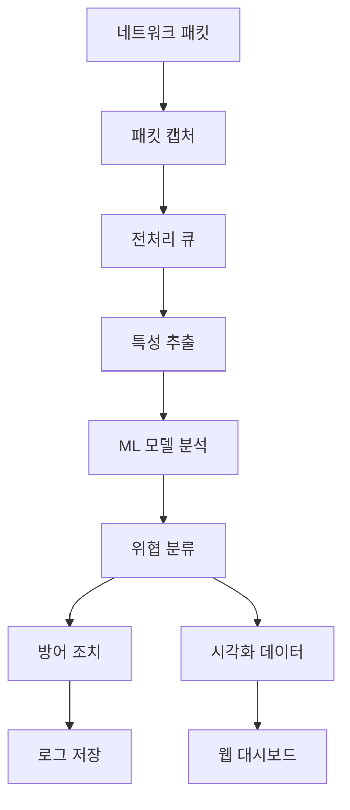

# IDS 프로젝트 진행도 & 시각화 가이드라인

> **문서 버전**: v1.0 | **최종 업데이트**: 2024년 12월 | **담당자**: IDS 개발팀

---

## 목차

1. [현재 프로젝트 진행도](#현재-프로젝트-진행도)
2. [시스템 아키텍처 개요](#시스템-아키텍처-개요)
3. [시각화 요구사항](#시각화-요구사항)
4. [데이터 구조 및 접근 방법](#데이터-구조-및-접근-방법)
5. [UI/UX 가이드라인](#uiux-가이드라인)
6. [기술 스택 및 도구](#기술-스택-및-도구)
7. [작업 분담 및 일정](#작업-분담-및-일정)
8. [개발 환경 설정](#개발-환경-설정)

---

## 현재 프로젝트 진행도

### 완료된 작업 (80%)

#### 핵심 엔진 개발
- [x] **IDSAgent_RL.py** - 메인 IDS 에이전트 완성
  - 메모리 누수 문제 해결 완료
  - 적응형 패킷 처리 구현
  - CLI 전용 인터페이스 구현
  - 5개 멀티스레드 처리 시스템

- [x] **머신러닝 모델 최적화**
  - 랜덤 포레스트 + DQN 하이브리드 모델
  - 경험 재생 버퍼 구현
  - 모델 압축 및 양자화

- [x] **패킷 캡처 시스템**  
  - 최적화된 패킷 캡처 (2가지 버전)
  - 실시간 큐 관리 시스템
  - 메모리 효율적 처리

#### 보안 및 방어 시스템
- [x] **자동 방어 메커니즘**
  - IP 차단 시스템
  - 트래픽 제어
  - 실시간 위협 알림

- [x] **공격 탐지 및 분류**
  - Port Scan 탐지
  - DDoS 공격 탐지  
  - 비정상 패킷 분석

#### 데이터 관리
- [x] **훈련 데이터 생성기**
  - TrafficGeneratorApp - 공격 패킷 생성
  - 다양한 공격 시나리오 지원
  - 패킷 전송 문제 해결 완료

### 진행 중인 작업 (15%)

#### 로그/데이터 관리 시스템
- 환경별 저장 정책 설계 (임베디드 50MB, PC 500MB)
- 자동 정리 및 아카이브 시스템
- 학습 완료 후 데이터 경량화

### 예정된 작업 (5%)

#### 시각화 웹 인터페이스
- 실시간 대시보드
- 공격 분석 차트
- 시스템 모니터링 UI
- 관리자 제어 패널

---

## 시스템 아키텍처 개요

### 데이터 흐름



### 멀티스레드 구조

```
IDS Agent (Main Thread)
├── Thread 1: 패킷 캡처 (packet_capture)
├── Thread 2: 패킷 처리 (packet_processing) 
├── Thread 3: ML 분석 (ml_analysis)
├── Thread 4: 방어 조치 (defense_actions)
└── Thread 5: 대시보드 (realtime_stats)
```

---

## 시각화 요구사항

### 우선순위 1: 핵심 대시보드

#### 실시간 모니터링
```javascript
// 필수 차트 유형
실시간 데이터 요구사항:
├── 네트워크 트래픽 (Line Chart) - 초당 업데이트
├── 위협 탐지 현황 (Alert Panel) - 실시간 알림
├── 시스템 리소스 (Gauge Chart) - CPU/Memory/Disk
├── 지도 시각화 (World Map) - 공격 출발지
└── 최근 이벤트 (Table) - 최신 50개 이벤트
```

#### 차트 디자인 가이드
```css
색상 팔레트:
- 정상 트래픽: #2ECC71 (초록)
- 의심스러운: #F39C12 (주황) 
- 위험한 공격: #E74C3C (빨강)
- 시스템 정보: #3498DB (파랑)
- 배경: #2C3E50 (다크 그레이)
- 텍스트: #ECF0F1 (밝은 회색)
```

### 우선순위 2: 분석 대시보드

#### 성능 분석
```python
차트 요구사항:
├── 공격 유형별 통계 (Pie Chart)
├── 시간별 트렌드 (Multi-line Chart)
├── 모델 정확도 (Progress Bar)
├── 방어 성공률 (Donut Chart)
└── 상위 공격 IP (Horizontal Bar)
```

#### ML 모델 성능
```python
머신러닝 시각화:
├── 학습 곡선 (Training/Validation Loss)
├── 혼동 행렬 (Confusion Matrix)
├── 특성 중요도 (Feature Importance)
├── 예측 정확도 (Accuracy Metrics)
└── 실시간 예측 결과 (Live Predictions)
```

### 우선순위 3: 관리자 패널

#### 시스템 제어
```javascript
관리 기능:
├── IDS 시작/중지 제어
├── 설정 변경 인터페이스
├── 로그 뷰어 및 검색
├── IP 차단 관리
└── 성능 튜닝 도구
```

---

## 데이터 구조 및 접근 방법

### 주요 데이터 소스

#### **1. 실시간 데이터 (WebSocket)**
```python
# 실시간 스트리밍 데이터
websocket_endpoints = {
    'network_stats': '/ws/network',      # 네트워크 통계
    'threats': '/ws/threats',            # 위협 알림
    'system_info': '/ws/system',         # 시스템 정보
    'ml_predictions': '/ws/ml'           # ML 예측 결과
}

# 데이터 구조 예시
{
    "timestamp": "2024-12-28T10:30:00Z",
    "packet_count": 1547,
    "threat_level": "medium",
    "cpu_usage": 45.2,
    "memory_usage": 78.5,
    "blocked_ips": 12
}
```

#### **2. 히스토리 데이터 (REST API)**
```python
# REST API 엔드포인트
api_endpoints = {
    'GET /api/attacks': '공격 이력 조회',
    'GET /api/stats': '통계 데이터',
    'GET /api/logs': '로그 데이터',
    'GET /api/models': '모델 성능 지표',
    'POST /api/config': '설정 변경'
}

# 페이지네이션 지원
{
    "data": [...],
    "page": 1,
    "per_page": 50,
    "total": 1250,
    "has_next": true
}
```

#### **3. 파일 기반 데이터**
```python
데이터 파일 위치:
├── captured_packets_*.csv - 패킷 로그
├── security_alerts.json - 보안 알림
├── defense_actions.log - 방어 조치 로그  
├── random_forest_model.pkl - ML 모델
└── config/*.json - 설정 파일

# CSV 데이터 구조
timestamp,src_ip,dst_ip,protocol,packet_size,threat_score,action
2024-12-28T10:30:15,192.168.1.100,10.0.0.1,TCP,1460,0.85,blocked
```

### 데이터 업데이트 주기

```python
실시간 업데이트:
├── 네트워크 통계: 1초마다
├── 위협 알림: 즉시 (이벤트 기반)
├── 시스템 리소스: 5초마다
└── 차트 데이터: 10초마다

배치 업데이트:
├── 일일 통계: 매일 00:00
├── 주간 리포트: 매주 월요일
├── 모델 재학습: 필요시 (수동)
└── 로그 정리: 매일 02:00
```

---

## UI/UX 가이드라인

### 반응형 디자인

#### **화면 크기별 레이아웃**
```css
/* 데스크톱 (1920x1080+) */
.desktop-layout {
    grid-template-columns: 250px 1fr 300px;
    /* 사이드바 | 메인 콘텐츠 | 알림 패널 */
}

/* 태블릿 (768px-1919px) */
.tablet-layout {
    grid-template-columns: 1fr;
    grid-template-rows: auto 1fr auto;
    /* 헤더 | 메인 | 푸터 */
}

/* 모바일 (0-767px) */
.mobile-layout {
    flex-direction: column;
    /* 세로 스택 레이아웃 */
}
```

### 다크 테마 (기본)

```css
:root {
    /* Primary Colors */
    --bg-primary: #1a1a1a;
    --bg-secondary: #2d2d2d;
    --text-primary: #ffffff;
    --text-secondary: #b3b3b3;
    
    /* Status Colors */
    --success: #00d084;
    --warning: #ffb020;
    --error: #ff4757;
    --info: #3742fa;
    
    /* Chart Colors */
    --chart-normal: #2ecc71;
    --chart-suspicious: #f39c12;
    --chart-dangerous: #e74c3c;
}
```

### 성능 가이드라인

```javascript
성능 최적화 규칙:
├── 차트 렌더링: Canvas 사용 (SVG 지양)
├── 데이터 업데이트: Virtual Scrolling 적용
├── 메모리 관리: 오래된 데이터 자동 정리
├── 모바일 최적화: 터치 친화적 인터페이스
└── 로딩 시간: 초기 로딩 3초 이내
```

### 사용자 경험 원칙

```markdown
UX 우선순위:
1. **직관성** - 3초 내 핵심 정보 파악 가능
2. **반응성** - 사용자 액션에 즉시 피드백
3. **일관성** - 모든 페이지 통일된 디자인
4. **접근성** - 색약자 고려, 키보드 내비게이션
5. **신뢰성** - 에러 상황 명확한 안내
```

---

## 기술 스택 및 도구

### 프론트엔드

#### 핵심 프레임워크
```javascript
권장 기술 스택:
├── React 18+ (또는 Vue 3+)
├── D3.js / Chart.js - 데이터 시각화
├── Tailwind CSS - 스타일링
├── Socket.IO - 실시간 통신
├── PWA - 모바일 최적화
└── Vite - 빌드 도구
```

#### 차트 라이브러리 비교
```python
라이브러리 선택 가이드:
├── Chart.js: 간단한 차트 (추천)
├── D3.js: 복잡한 커스텀 시각화
├── Plotly.js: 과학적 차트
├── ApexCharts: 현대적 디자인
└── Observable Plot: 빠른 프로토타이핑
```

### 백엔드

#### API 서버
```python
기술 스택:
├── Flask/FastAPI - 웹 프레임워크
├── Socket.IO - 실시간 통신
├── SQLite/PostgreSQL - 데이터베이스  
├── Redis - 캐싱 및 세션
├── Docker - 컨테이너화
└── Gunicorn - WSGI 서버

# 추천 Flask 구조
app/
├── api/ - REST API 라우트
├── websocket/ - Socket.IO 이벤트
├── models/ - 데이터 모델
├── services/ - 비즈니스 로직
└── utils/ - 유틸리티 함수
```

### 데이터베이스 스키마

```sql
-- 공격 이벤트 테이블
CREATE TABLE attacks (
    id INTEGER PRIMARY KEY,
    timestamp DATETIME,
    src_ip VARCHAR(15),
    dst_ip VARCHAR(15),
    attack_type VARCHAR(50),
    severity INTEGER,
    blocked BOOLEAN,
    details JSON
);

-- 시스템 메트릭 테이블  
CREATE TABLE metrics (
    id INTEGER PRIMARY KEY,
    timestamp DATETIME,
    cpu_usage FLOAT,
    memory_usage FLOAT,
    packet_count INTEGER,
    threat_count INTEGER
);
```

---

## 작업 분담 및 일정

### Phase 1: 기본 대시보드 (2주)

#### Frontend 개발자
```markdown
작업 내용:
├── 실시간 네트워크 차트 구현
├── 위협 알림 패널 개발  
├── 시스템 리소스 모니터링
├── 반응형 레이아웃 구현
└── 다크 테마 UI 완성

예상 소요: 10일
```

#### Backend 개발자  
```markdown
작업 내용:
├── WebSocket 서버 구현
├── REST API 설계 및 구현
├── 데이터베이스 스키마 설계
├── 실시간 데이터 스트리밍
└── Docker 환경 구성

예상 소요: 8일
```

### Phase 2: 고급 분석 (2주)

#### Data 시각화 전문가
```markdown
작업 내용:  
├── ML 모델 성능 시각화
├── 지리적 공격 분포 지도
├── 상호작용 차트 개발
├── 커스텀 대시보드 빌더
└── 실시간 예측 결과 차트

예상 소요: 12일
```

### Phase 3: 관리자 패널 (1주)

#### Full-stack 개발자
```markdown
작업 내용:
├── 시스템 제어 인터페이스  
├── IP 차단 관리 도구
├── 로그 뷰어 및 검색
├── 설정 변경 UI
└── 사용자 권한 관리

예상 소요: 7일
```

### 마일스톤

```gantt
dateFormat  YYYY-MM-DD
title       시각화 개발 일정

section Phase 1
기본 대시보드    :active, phase1, 2024-12-28, 14d
API 개발        :api, 2024-12-28, 8d
UI 구현         :ui, 2024-12-30, 10d

section Phase 2  
고급 분석       :phase2, after phase1, 14d
ML 시각화       :ml, after phase1, 12d

section Phase 3
관리자 패널     :phase3, after phase2, 7d
테스트 & 배포   :deploy, after phase3, 3d
```

---

## 개발 환경 설정

### 사전 요구사항

```bash
시스템 요구사항:
├── Python 3.9+ 
├── Node.js 16+
├── PostgreSQL 13+ (또는 SQLite)
├── Redis 6+
└── Docker (선택사항)
```

### 빠른 시작

#### **1. 저장소 클론**
```bash
git clone <repository-url>
cd Intrusion_DetectionSystem
```

#### **2. Python 환경 설정**
```bash
cd IDS
python -m venv venv
source venv/bin/activate  # Windows: venv\Scripts\activate
pip install -r requirements.txt
```

#### **3. 프론트엔드 설정**
```bash
cd IDS_visualization_web
npm install
npm run dev
```

#### **4. 데이터베이스 초기화**
```bash
# PostgreSQL 설정 (선택사항)
createdb ids_database
python manage.py migrate

# 또는 SQLite 사용 (기본값)
python scripts/init_database.py
```

### 개발 도구

```json
// package.json 추천 스크립트
{
  "scripts": {
    "dev": "vite --host 0.0.0.0 --port 3000",
    "build": "vite build",  
    "preview": "vite preview",
    "test": "vitest",
    "lint": "eslint . --fix",
    "format": "prettier --write ."
  }
}
```

### 모니터링 도구

```javascript
개발 환경 모니터링:
├── Browser DevTools - 성능 분석
├── React DevTools - 컴포넌트 디버깅
├── Network Tab - API 호출 추적  
├── Lighthouse - 성능 측정
└── Sentry - 에러 트래킹 (production)
```

---

## 임베디드 환경 헤드리스 모드 시각화

### 산업용 제어패널 시각화 전략

산업용 제어패널이나 임베디드 시스템에서는 직접적인 GUI 없이도 효과적인 시각화가 필요합니다. 
다음은 헤드리스 환경에서 IDS 데이터를 시각화하는 다양한 방법들입니다.

### 원격 웹 모니터링

#### **1. 경량 웹 서버 구축**
```python
# 임베디드 시스템에서 실행되는 경량 Flask 서버
from flask import Flask, render_template, jsonify
from flask_socketio import SocketIO

app = Flask(__name__)
socketio = SocketIO(app, cors_allowed_origins="*")

# 메모리 사용량 최소화를 위한 설정
app.config['TEMPLATES_AUTO_RELOAD'] = False
app.config['SEND_FILE_MAX_AGE_DEFAULT'] = 3600

@app.route('/api/status')
def get_system_status():
    return jsonify({
        'threat_level': get_current_threat_level(),
        'blocked_ips': get_blocked_ip_count(),
        'cpu_usage': get_cpu_usage(),
        'memory_usage': get_memory_usage()
    })
```

#### **2. 원격 접속 방식**
```markdown
접속 방법:
├── WiFi/이더넷을 통한 로컬 네트워크 접근
│   └── http://192.168.1.100:5000 (임베디드 시스템 IP)
├── VPN을 통한 원격 접근
│   └── 보안이 강화된 원격 모니터링
├── 모바일 핫스팟 활용
│   └── 긴급 상황시 스마트폰으로 임시 네트워크 제공
└── 시리얼 통신 기반 터널링
    └── RS485/RS232를 통한 데이터 전송
```

### 하드웨어 기반 시각화

#### **1. LCD/OLED 디스플레이**
```python
# 작은 OLED 화면에 핵심 정보 표시
import luma.oled
from luma.core.interface.serial import i2c
from luma.oled.device import ssd1306

class EmbeddedDisplay:
    def __init__(self):
        serial = i2c(port=1, address=0x3C)
        self.device = ssd1306(serial, width=128, height=64)
    
    def show_ids_status(self, threat_count, blocked_ips, cpu_usage):
        with canvas(self.device) as draw:
            draw.text((0, 0), f"Threats: {threat_count}", fill="white")
            draw.text((0, 16), f"Blocked: {blocked_ips}", fill="white")
            draw.text((0, 32), f"CPU: {cpu_usage}%", fill="white")
            draw.text((0, 48), f"Status: {'ACTIVE' if threat_count > 0 else 'NORMAL'}", fill="white")

# 표시 가능한 정보
정보 우선순위:
├── Level 1: 시스템 상태 (정상/위험/오류)
├── Level 2: 현재 위협 수준 및 차단된 IP 수
├── Level 3: CPU/메모리 사용률
├── Level 4: 최근 공격 유형
└── Level 5: 네트워크 트래픽 간단 그래프
```

#### **2. LED 상태 표시등**
```python
# GPIO를 통한 LED 제어
import RPi.GPIO as GPIO
import time

class StatusLED:
    def __init__(self):
        self.GREEN_PIN = 18   # 정상 상태
        self.YELLOW_PIN = 19  # 주의 상태  
        self.RED_PIN = 20     # 위험 상태
        self.BLUE_PIN = 21    # 시스템 활성화
        
        GPIO.setmode(GPIO.BCM)
        for pin in [self.GREEN_PIN, self.YELLOW_PIN, self.RED_PIN, self.BLUE_PIN]:
            GPIO.setup(pin, GPIO.OUT)
    
    def update_status(self, threat_level):
        # 모든 LED 끄기
        GPIO.output([self.GREEN_PIN, self.YELLOW_PIN, self.RED_PIN], GPIO.LOW)
        
        if threat_level == 0:
            GPIO.output(self.GREEN_PIN, GPIO.HIGH)  # 정상
        elif threat_level <= 5:
            GPIO.output(self.YELLOW_PIN, GPIO.HIGH)  # 주의
        else:
            self.red_blink()  # 위험 - 깜빡임

# LED 상태 코드
LED 의미:
├── 초록 LED: 시스템 정상 작동
├── 노랑 LED: 경미한 위협 탐지
├── 빨강 LED: 심각한 위협 또는 시스템 오류
├── 파랑 LED: 시스템 활성 상태 (항상 켜짐)
└── 깜빡임 패턴으로 추가 정보 전달
```

### 터미널 기반 시각화

#### **1. ASCII 기반 대시보드**
```python
# SSH/시리얼 터미널에서 실행되는 텍스트 대시보드
import curses
import time
from collections import deque

class TerminalDashboard:
    def __init__(self):
        self.screen = curses.initscr()
        curses.cbreak()
        curses.noecho()
        self.screen.keypad(True)
        
    def draw_dashboard(self, stats):
        self.screen.clear()
        
        # 제목
        self.screen.addstr(0, 0, "=== IDS Terminal Dashboard ===")
        
        # 시스템 상태
        self.screen.addstr(2, 0, f"System Status: {stats['status']}")
        self.screen.addstr(3, 0, f"Threat Level: {stats['threat_level']}")
        
        # 통계 정보
        self.screen.addstr(5, 0, f"Packets Analyzed: {stats['packet_count']:,}")
        self.screen.addstr(6, 0, f"Threats Blocked: {stats['blocked_count']:,}")
        self.screen.addstr(7, 0, f"CPU Usage: {stats['cpu_usage']:.1f}%")
        self.screen.addstr(8, 0, f"Memory Usage: {stats['memory_usage']:.1f}%")
        
        # ASCII 그래프
        self.draw_ascii_graph(stats['traffic_history'], 10, 0)
        
        self.screen.refresh()
    
    def draw_ascii_graph(self, data, y_pos, x_pos):
        max_val = max(data) if data else 1
        self.screen.addstr(y_pos, x_pos, "Traffic (packets/sec):")
        
        for i, val in enumerate(data[-50:]):  # 최근 50개 데이터포인트
            height = int((val / max_val) * 10)
            self.screen.addstr(y_pos + 1 + i, x_pos, '█' * height)

# 터미널 명령어 예시
SSH 접속 후 사용 가능한 명령어:
├── ids-status: 현재 시스템 상태 조회
├── ids-threats: 최근 위협 목록 조회  
├── ids-dashboard: 실시간 터미널 대시보드 실행
├── ids-logs: 로그 파일 실시간 모니터링
└── ids-config: 설정 변경 (관리자만)
```

### IoT 프로토콜 활용

#### **1. MQTT 브로커 연동**
```python
# MQTT를 통한 데이터 퍼블리싱
import paho.mqtt.client as mqtt
import json

class MQTTPublisher:
    def __init__(self, broker_host='localhost', port=1883):
        self.client = mqtt.Client()
        self.client.connect(broker_host, port, 60)
        self.client.loop_start()
    
    def publish_ids_data(self, threat_data):
        topics = {
            'ids/threats/count': threat_data['count'],
            'ids/threats/level': threat_data['level'],
            'ids/system/cpu': threat_data['cpu_usage'],
            'ids/system/memory': threat_data['memory_usage'],
            'ids/attacks/recent': json.dumps(threat_data['recent_attacks'])
        }
        
        for topic, data in topics.items():
            self.client.publish(topic, str(data))

# MQTT 토픽 구조
MQTT 토픽 설계:
├── ids/status/system - 전체 시스템 상태
├── ids/threats/count - 현재 위협 개수
├── ids/threats/level - 위협 레벨 (0-10)
├── ids/attacks/recent - 최근 공격 정보 (JSON)
├── ids/system/cpu - CPU 사용률
├── ids/system/memory - 메모리 사용률
└── ids/alerts/critical - 중요 알림 (즉시 전송)
```

#### **2. ModBus 통신**
```python
# 산업용 ModBus 프로토콜을 통한 데이터 전송
from pymodbus.server.sync import StartTcpServer
from pymodbus.datastore import ModbusSequentialDataBlock, ModbusSlaveContext

class IDSModBusServer:
    def __init__(self):
        # 레지스터 매핑
        self.registers = {
            'system_status': 1,      # 0=정상, 1=위험, 2=오류
            'threat_count': 2,       # 현재 위협 개수
            'cpu_usage': 3,          # CPU 사용률 (0-100)
            'memory_usage': 4,       # 메모리 사용률 (0-100)
            'blocked_ips': 5,        # 차단된 IP 수
        }
    
    def update_registers(self, ids_data):
        context = self.server.context[0x00]
        
        context.setValues(3, self.registers['threat_count'], [ids_data['threat_count']])
        context.setValues(3, self.registers['cpu_usage'], [int(ids_data['cpu_usage'])])
        context.setValues(3, self.registers['memory_usage'], [int(ids_data['memory_usage'])])

# ModBus 레지스터 맵
ModBus 레지스터 구조:
├── Register 1: 시스템 상태 (0-2)
├── Register 2: 위협 개수 (0-65535)
├── Register 3: CPU 사용률 (0-100)
├── Register 4: 메모리 사용률 (0-100)
└── Register 5-20: 확장 데이터 영역
```

### 모바일 앱 연동

#### **1. RESTful API 설계**
```python
# 모바일 앱용 경량 API
from flask import Flask, jsonify
from flask_cors import CORS

app = Flask(__name__)
CORS(app)  # 모바일 앱에서 접근 허용

@app.route('/api/mobile/dashboard')
def mobile_dashboard():
    """모바일 최적화된 대시보드 데이터"""
    return jsonify({
        'timestamp': int(time.time()),
        'status': {
            'system': 'active',
            'threat_level': get_threat_level(),
            'alerts': get_active_alerts_count()
        },
        'stats': {
            'threats_today': get_threats_today(),
            'blocked_ips': get_blocked_ips_count(),
            'uptime': get_system_uptime()
        },
        'recent_events': get_recent_events(limit=5)  # 모바일에서는 최소한만
    })

@app.route('/api/mobile/alerts')
def mobile_alerts():
    """중요 알림만 필터링"""
    alerts = get_alerts(severity='high')
    return jsonify({
        'critical_alerts': alerts[:10],  # 상위 10개만
        'total_count': len(alerts)
    })

# 모바일 앱 기능
모바일 앱 주요 기능:
├── 푸시 알림 - 중요 위협 발생시 즉시 알림
├── 원격 제어 - 긴급 시스템 중지/재시작
├── 상태 모니터링 - 실시간 시스템 상태 확인
├── 로그 조회 - 최근 이벤트 간단 조회
└── 설정 변경 - 기본적인 시스템 설정 수정
```

### 클라우드 연동

#### **1. 클라우드 모니터링 플랫폼**
```python
# AWS CloudWatch, Azure Monitor 등 클라우드 서비스 연동
import boto3
from datetime import datetime

class CloudMonitoring:
    def __init__(self):
        self.cloudwatch = boto3.client('cloudwatch')
    
    def send_metrics(self, metrics_data):
        """IDS 메트릭을 클라우드로 전송"""
        self.cloudwatch.put_metric_data(
            Namespace='IDS/Security',
            MetricData=[
                {
                    'MetricName': 'ThreatCount',
                    'Value': metrics_data['threat_count'],
                    'Timestamp': datetime.utcnow(),
                    'Dimensions': [
                        {
                            'Name': 'DeviceID',
                            'Value': metrics_data['device_id']
                        }
                    ]
                },
                {
                    'MetricName': 'SystemLoad',
                    'Value': metrics_data['cpu_usage'],
                    'Timestamp': datetime.utcnow(),
                    'Unit': 'Percent'
                }
            ]
        )

# 클라우드 연동 이점
클라우드 모니터링 장점:
├── 중앙 집중식 관리 - 여러 임베디드 시스템 통합 모니터링
├── 확장성 - 데이터 저장 및 분석 용량 제한 없음
├── 고급 분석 - AI/ML 기반 이상 탐지 및 예측
├── 알림 시스템 - 이메일, SMS, Slack 등 다양한 알림 방식
└── 백업 및 복구 - 클라우드 기반 데이터 백업
```

### 성능 최적화 고려사항

#### **1. 임베디드 환경 최적화**
```python
# 메모리 및 CPU 사용량 최소화
from collections import deque
import sys
import time

class OptimizedVisualization:
    def __init__(self, max_memory_mb=50):
        self.max_memory = max_memory_mb * 1024 * 1024
        self.data_buffer = deque(maxlen=1000)  # 최대 1000개 데이터포인트만 유지
        
    def add_data_point(self, data):
        """메모리 효율적인 데이터 추가"""
        if sys.getsizeof(self.data_buffer) > self.max_memory:
            # 오래된 데이터 제거
            for _ in range(100):
                if self.data_buffer:
                    self.data_buffer.popleft()
        
        self.data_buffer.append({
            'timestamp': int(time.time()),
            'value': data,
            'compressed': True  # 압축된 데이터 표시
        })
    
    def get_summary_stats(self):
        """상세 데이터 대신 요약 통계만 반환"""
        if not self.data_buffer:
            return {}
            
        values = [item['value'] for item in self.data_buffer]
        return {
            'count': len(values),
            'avg': sum(values) / len(values),
            'max': max(values),
            'min': min(values),
            'latest': values[-1] if values else 0
        }

# 최적화 전략
임베디드 최적화 방법:
├── 데이터 압축 - 전송 데이터량 최소화
├── 배치 처리 - 개별 전송 대신 배치로 묶어서 전송
├── 캐싱 전략 - 자주 요청되는 데이터 캐싱
├── 비동기 처리 - 블로킹 없는 데이터 처리
├── 선택적 업데이트 - 변경된 데이터만 전송
└── 압축 알고리즘 - gzip, lz4 등 경량 압축 사용
```

#### **2. 네트워크 대역폭 최적화**
```python
# 저대역폭 환경을 위한 데이터 최적화
class BandwidthOptimizer:
    def __init__(self, max_bandwidth_kbps=64):
        self.max_bandwidth = max_bandwidth_kbps * 1024  # bytes per second
        self.last_update = time.time()
        
    def optimize_data(self, raw_data):
        """대역폭에 따라 데이터 품질 조절"""
        current_time = time.time()
        time_diff = current_time - self.last_update
        
        # 대역폭이 부족한 경우 데이터 간소화
        if time_diff < 1.0:  # 1초 미만 간격의 빈번한 업데이트
            return self.compress_data(raw_data, compression_level='high')
        else:
            return self.compress_data(raw_data, compression_level='normal')
    
    def compress_data(self, data, compression_level='normal'):
        if compression_level == 'high':
            # 핵심 데이터만 전송
            return {
                'status': data.get('system_status', 0),
                'threats': data.get('threat_count', 0),
                'timestamp': int(time.time())
            }
        else:
            # 일반 압축
            return {
                'status': data.get('system_status', 0),
                'threats': data.get('threat_count', 0),
                'cpu': round(data.get('cpu_usage', 0), 1),
                'memory': round(data.get('memory_usage', 0), 1),
                'timestamp': int(time.time())
            }

# 네트워크 최적화 기법
네트워크 최적화:
├── 델타 압축 - 이전 데이터와의 차이만 전송
├── 적응적 업데이트 주기 - 네트워크 상태에 따라 주기 조절
├── 우선순위 기반 전송 - 중요 데이터 우선 전송
├── 연결 풀링 - HTTP 연결 재사용
└── 오프라인 모드 - 네트워크 단절시 로컬 저장 후 재연결시 전송
```


## 다음 단계

### 즉시 시작 가능한 작업

1. **UI 목업 작성** - Figma/Adobe XD 활용
2. **데이터 모델링** - ERD 및 API 스키마 정의  
3. **프로토타입 개발** - 핵심 차트 1-2개 먼저 구현
4. **테스트 환경** - 개발/스테이징 서버 구축
5. **임베디드 모드 프로토타입** - 헤드리스 환경 시각화 테스트


