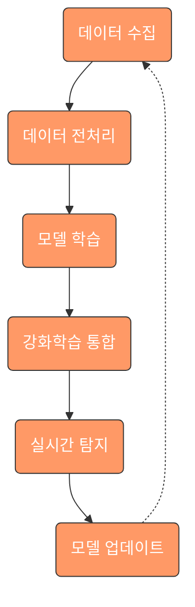
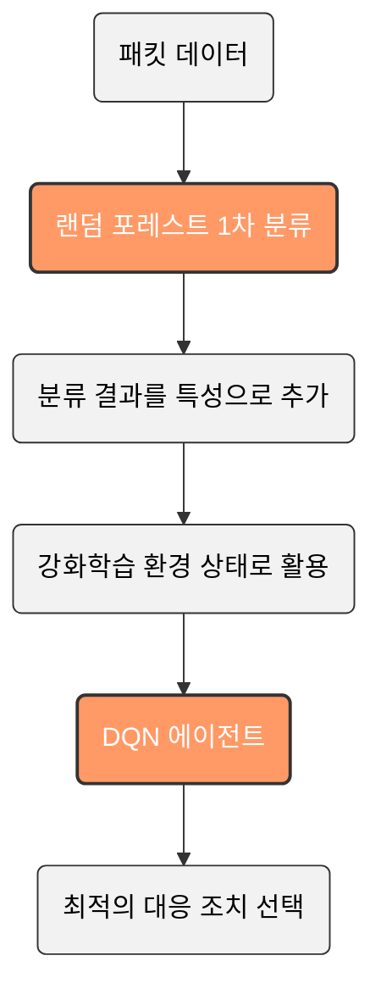
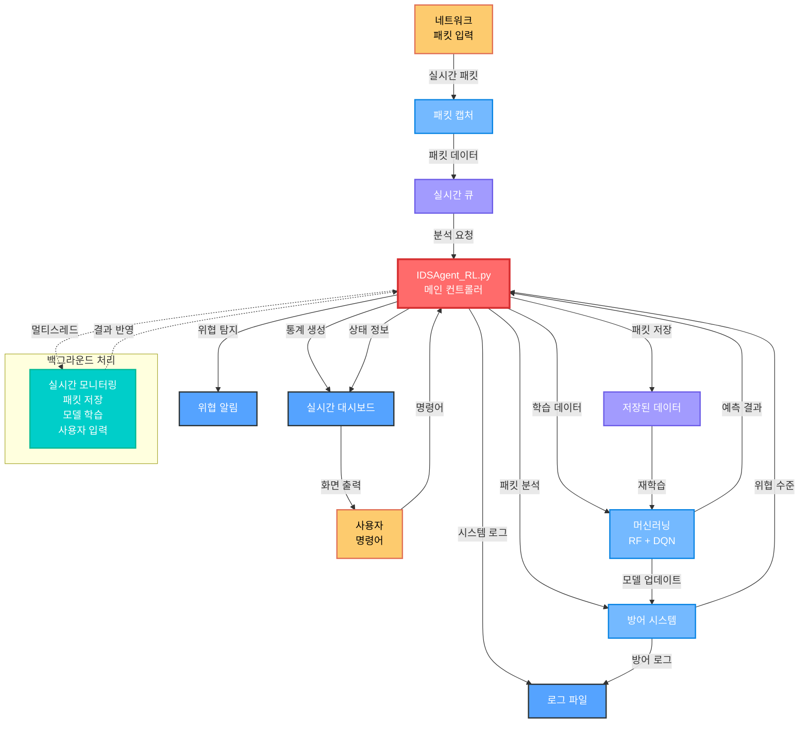

# IDS Agent - 침입 탐지 시스템 (Intrusion Detection System)

<div align="center">
  
  
  
  
</div>

## 목차

1. [빠른 시작](#빠른-시작)
2. [프로젝트 개요](#프로젝트-개요)
3. [팀원 정보](#팀원-정보)
4. [사용개발환경](#사용개발환경)
5. [실습 및 테스트 환경](#실습-및-테스트-환경)
6. [프로젝트 구조](#프로젝트-구조)
7. [사용된 모듈](#사용된-모듈)
8. [AI 에이전트 작동 방식](#ai-에이전트-작동-방식)
9. [하이브리드 접근 방식의 특징](#하이브리드-접근-방식의-특징)
10. [주요 시스템 구성 요소](#주요-시스템-구성-요소)
11. [강화학습 관련 클래스 및 메서드](#강화학습-관련-클래스-및-메서드)
12. [모듈 간 통합 및 데이터 흐름](#모듈-간-통합-및-데이터-흐름)
13. [전체 시스템 아키텍처](#전체-시스템-아키텍처)
14. [CLI 인터페이스 사용법](#cli-인터페이스-사용법)
15. [프로그램 작동법](#프로그램-작동법)
16. [메모리 최적화 전략](#메모리-최적화-전략)
17. [운영 모드](#운영-모드)
18. [향후 개발 계획](#향후-개발-계획)

## 빠른 시작

### 자동 설치 및 실행

#### Windows 사용자
```bash
# 관리자 권한으로 명령 프롬프트 실행 후
setup_and_run.bat
```

#### Linux/Unix/macOS 사용자
```bash
# 실행 권한 부여 (최초 1회)
chmod +x setup_and_run.sh

# 실행
sudo ./setup_and_run.sh
```

### 수동 설치 (고급 사용자용)

```bash
# 1. 의존성 패키지 설치
pip install -r requirements.txt

# 2. IDS Agent 실행
cd IDS
python IDSAgent_RL.py

# 또는 모드 지정 실행
python IDSAgent_RL.py --mode lightweight    # 경량 모드
python IDSAgent_RL.py --mode performance    # 고성능 모드
python IDSAgent_RL.py --debug               # 디버그 모드
```

## 프로젝트 개요

실시간으로 네트워크 보안 취약점을 탐지하고 자동으로 대응하는 AI 기반 침입 탐지 시스템입니다.   
랜덤 포레스트와 강화학습의 장점을 결합한 하이브리드 접근 방식을 통해 기존 방식보다 높은 정확도와 적응성을 제공합니다.

### 시스템 핵심 기능

본 시스템은 다음 핵심 기능들이 유기적으로 연결되어 동작합니다:

1. **실시간 패킷 캡처** - 네트워크 인터페이스에서 실시간 패킷 수집 및 큐 관리
2. **데이터 전처리** - 머신러닝 모델에 적합한 데이터 변환 및 특성 추출  
3. **하이브리드 AI 모델** - 랜덤 포레스트와 강화학습(DQN) 통합
4. **실시간 방어 메커니즘** - IP 차단, 트래픽 제어, 자동 대응
5. **위협 알림 시스템** - 위험도별 알림 및 실시간 대시보드
6. **멀티스레드 처리** - 5개 백그라운드 스레드를 통한 동시 처리

## 팀원 정보

- **안상수 [팀장]**: 시스템 설계, 메인프로그래밍
- **신명재 [팀원]**: 데이터 학습, 문서작업, 피드백 및 시각화 웹앱 제작
- **민인영 [팀원]**: 데이터 학습, 이미지 시각화, 피드백 및 시각화 웹앱 제작
- **최준형 [팀원]**: 데이터 학습, 피드백 및 시각화 웹앱 제작

## 사용개발환경

### 프론트엔드
- **IDE**: WebStorm
- **언어**: JavaScript, CSS
- **프레임워크**: React (웹 시각화 대시보드)

### 백엔드 
- **IDE**: PyCharm
- **언어**: Python
- **프레임워크**: Flask (API 서버)

### IDS 프로그램
- **언어**: Python
- **주요 라이브러리**: Scapy, PyTorch, scikit-learn

### 기타 개발도구
- **Google Colab**: 머신러닝 모델 실험 및 훈련
- **VS Code**: 코드 편집 및 디버깅
- **OpenAI Gym**: 강화학습 환경 구축
- **VMware**: 가상환경

## 실습 및 테스트 환경

### 가상머신 설치 및 상태 확인

#### 지원 가상화 플랫폼 및 운영체제

**가상화 플랫폼 지원 현황**

| 가상화 플랫폼 | Windows Host | Linux Host | macOS Host |
|---------------|--------------|------------|------------|
| **VMware Workstation/Fusion** | 지원 | 지원 | 지원 |
| **VirtualBox** | 지원 | 지원 | 지원 |
| **Hyper-V** | 지원 | 미지원 | 미지원 |

**게스트 OS 지원 현황**

| 운영체제 | IDS 시스템 | 침입 테스트 | 용도 |
|----------|------------|-------------|------|
| **Ubuntu 20.04 LTS** | 최적화 | 지원 | IDS 메인 시스템 |
| **Kali Linux** | 지원 | 최적화 | 침입 테스트 도구 |
| **CentOS/RHEL** | 지원 | 지원 | 엔터프라이즈 환경 |
| **Windows 10/11** | 지원 | 지원 | 호스트/게스트 겸용 |
| **Debian** | 지원 | 지원 | 경량 시스템 |

**권장 환경**: Ubuntu VM (IDS 시스템용) + Kali Linux VM (침입 테스트용)

#### 가상머신 환경 확인 명령어
1. **가상머신 이름 확인**: `uname -a`
2. **게스트 OS 확인**: `Ubuntu: GNU/Linux [$ uname -o]`
3. **리눅스 배포판 확인**: `Ubuntu [$ uname -r]`

### 테스트베드 주소 정의

| 구분 | SENDER (공격자) | TARGET (방어자) |
|------|----------------|----------------|
| **역할** | 침입 테스트 도구 | IDS 모니터링 대상 |
| **IP 주소** | 실제 호스트 IP, VM IP (Kali, Ubuntu, CentOS), 루프백 주소, 클래스 내 인접 PC IP | 실제 시스템 IP, VM IP (Kali, Ubuntu, CentOS), 루프백 주소, 클래스 내 인접 PC IP |
| **하드웨어** | 실제 터미널 | 실제 터미널 |
| **네트워크 장비** | 허브, 라우터, 게이트웨이 | |
| **운영체제** | Real Host(Windows), VM(Kali, Ubuntu, CentOS) | Real Host(Windows), VM(Kali, Ubuntu, CentOS) |
| **소프트웨어** | **TrafficGeneratorApp.py** (SYN 플러드, UDP 플러드, ARP 스푸핑, ICMP 리다이렉트, HTTP Slowloris) | **IDSAgent_RL.py** (실시간 패킷 캡처, 머신러닝 탐지, 강화학습 방어, 자동 차단 시스템) |

### 실제 테스트 시나리오

#### 기본 테스트 구성
```bash
# SENDER (공격자 VM)
python IDS/scripts/components/TrafficGeneratorApp.py
# 또는 데이터 준비 앱에서 "트래픽 생성" 선택

# TARGET (방어자 VM)  
python IDS/IDSAgent_RL.py
# 또는 데이터 준비 앱에서 "패킷 캡처" 선택
```

#### 네트워크 격리 테스트
- **Host-Only 모드**: 가상머신 간 격리된 네트워크 환경
- **NAT 모드**: 외부 네트워크 접근이 필요한 경우
- **Bridge 모드**: 실제 네트워크와 동일한 환경

#### 테스트 검증 항목
1. **공격 탐지율**: 다양한 공격 패턴에 대한 탐지 성능
2. **오탐률**: 정상 트래픽을 공격으로 잘못 판단하는 비율  
3. **응답 시간**: 공격 탐지부터 방어 조치까지의 시간
4. **자원 사용률**: CPU, 메모리, 네트워크 대역폭 사용량

## 프로젝트 구조

현재 실제 구조에 따른 프로젝트 디렉토리 구성:

```
Intrusion_DetectionSystem/
├── IDSAgent_RL.py                    # 메인 통합 에이전트
├── IDS_Training_Data_Generator.py    # 데이터 준비 인터페이스 (GUI)
├── modules/                          # 핵심 기능 모듈
│   ├── __init__.py
│   ├── packet_capture.py             # 패킷 캡처 (기본 + 최적화 버전)
│   ├── optimized_packet_capture.py   # 최적화된 패킷 캡처
│   ├── optimized_packet_capture_simple.py  # 간단한 최적화 캡처
│   ├── reinforcement_learning.py     # 강화학습 환경 및 DQN 에이전트
│   ├── ml_models.py                  # 랜덤 포레스트 머신러닝 모델
│   ├── defense_mechanism.py          # 방어 메커니즘
│   ├── threat_alert_system.py        # 위협 알림 시스템
│   ├── suricata_manager.py           # 수리카타 통합 관리
│   ├── experience_replay_buffer.py   # 경험 재생 버퍼
│   ├── model_optimization.py         # 모델 최적화
│   └── utils.py                      # 유틸리티 함수
├── scripts/
│   └── components/                   # GUI 컴포넌트
│       ├── packet_collector.py       # 패킷 수집 GUI
│       ├── TrafficGeneratorApp.py    # 트래픽 생성기
│       └── DataPreprocessingApp.py   # 데이터 전처리 앱
├── logs/                             # 로그 파일 저장
├── docs/                             # 문서
└── README.md                         # 프로젝트 설명서
```

### IDS 에이전트 핵심 구조

**IDSAgent_RL.py**는 모든 모듈을 통합한 메인 실행 파일로 다음과 같은 구조를 가집니다:

- **멀티스레드 아키텍처**: 5개의 백그라운드 스레드 동시 실행
  - 실시간 대시보드 표시 스레드
  - 패킷 처리 및 저장 스레드  
  - 시스템 모니터링 스레드
  - 머신러닝 모델 학습 스레드
  - 사용자 입력 처리 스레드

- **운영 모드**: Lightweight(경량) / Performance(고성능) 동적 전환
- **실시간 위협 분석**: 방어 모듈 기반 패킷 위협 수준 분석
- **자동 대응 시스템**: IP 차단, 모니터링, 알림 등 단계별 대응

## 사용된 모듈

### 데이터 분석 모듈
- **pandas**: 데이터 조작 및 분석을 위한 Python 라이브러리로, DataFrame과 Series 자료구조 제공. 패킷 데이터 로드, CSV 파일 처리, 결측치 처리, 범주형 데이터 인코딩 및 데이터 전처리 파이프라인 구축에 활용 (메모리 최적화로 인해 현재는 제한적 사용)
- **numpy**: 다차원 배열 객체와 수학 함수를 제공하는 과학적 컴퓨팅 라이브러리. 패킷 데이터 벡터화, 수치형 특성 정규화, 머신러닝 모델 입력 데이터 변환 및 행렬 연산에 사용

### 머신러닝 관련 모듈
- **scikit-learn**: 다양한 머신러닝 알고리즘과 평가 도구를 제공하는 Python 라이브러리. 네트워크 패킷 분류를 위한 랜덤 포레스트 모델 구현, 특성 선택, 성능 평가 및 교차 검증에 활용
- **joblib**: Python 객체의 직렬화와 병렬 처리를 지원하는 라이브러리. 훈련된 랜덤 포레스트 모델을 파일로 저장하고 필요할 때 로드하는 데 사용

### 강화학습 관련 모듈
- **PyTorch**: 유연한 딥러닝 프레임워크로 동적 계산 그래프 구축 지원. 이 프로젝트에서는 DQN(Deep Q-Network) 구현, 신경망 모델 설계 및 학습에 활용
- **Gym**: 강화학습 환경 구축. 강화학습 알고리즘 개발 및 비교를 위한 표준화된 환경 인터페이스 제공. 네트워크 환경 모델링, 상태-행동-보상 체계 구현 및 에이전트 훈련에 사용

### 네트워크 및 패킷 캡처 관련 모듈
- **Scapy**: 패킷 캡처, 분석, 생성 및 전송 기능. 패킷 조작 및 네트워크 도구를 제공하는 강력한 Python 라이브러리. 네트워크 패킷 캡처, 실시간 모니터링, 패킷 분석 및 커스텀 트래픽 생성에 활용

### GUI 관련 모듈
- **PyQt6**: GUI 구현을 위한 Qt 프레임워크의 Python 바인딩. Qt 프레임워크의 Python 바인딩으로 크로스 플랫폼 GUI 개발 지원. 데이터 시각화 인터페이스, 전처리 도구 UI 및 사용자 대시보드 구현에 사용

### 기타 필수 모듈
- **colorama**: 터미널 컬러 출력 지원 (크로스 플랫폼)
- **tqdm**: 진행률 표시 바
- **psutil**: 시스템 리소스 모니터링
- **matplotlib/seaborn**: 데이터 시각화

## AI 에이전트 작동 방식



### 통합 에이전트 작동 흐름

**IDSAgent_RL.py**는 다음과 같은 순서로 작동합니다:

1. **초기화 단계**
   - 운영 모드 선택 (Lightweight/Performance)
   - 관리자 권한 확인 (Windows)
   - 패킷 캡처 코어 초기화
   - 방어 메커니즘 초기화

2. **패킷 수집 단계**
   - 네트워크 인터페이스 자동 탐지
   - 실시간 패킷 캡처 시작
   - 큐 기반 패킷 버퍼링

3. **멀티스레드 처리 시작**
   - 실시간 대시보드 스레드
   - 패킷 처리 및 저장 스레드
   - 모니터링 스레드
   - 머신러닝 학습 스레드
   - 사용자 입력 처리 스레드

4. **실시간 분석 및 대응**
   - 패킷 전처리 및 특성 추출
   - 랜덤 포레스트 1차 분류
   - DQN 에이전트 행동 결정
   - 방어 메커니즘 자동 실행

## 하이브리드 접근 방식의 특징

본 시스템은 랜덤 포레스트와 강화학습을 결합한 하이브리드 접근 방식을 사용합니다:



### 하이브리드 모델의 동작 원리

1. **랜덤 포레스트 1차 분류**: 패킷 데이터를 랜덤 포레스트로 1차적으로 분류하여 기본적인 악성/정상 구분
2. **특성 확장**: 랜덤 포레스트의 예측 확률값을 새로운 특성으로 추가하여 데이터 품질 향상
3. **강화학습 통합**: 확장된 특성을 강화학습 환경의 상태(state)로 활용
4. **동적 의사결정**: DQN 에이전트가 환경 상태를 기반으로 최적의 대응 조치 선택

### 시스템 장점

- **높은 정확도**: 랜덤 포레스트의 검증된 분류 성능과 강화학습의 적응성 결합
- **실시간 대응**: 패킷별 즉시 분석 및 대응 조치 실행
- **지속적 학습**: 새로운 위협 패턴에 대한 자동 적응 및 성능 향상
- **유연한 정책**: 환경 변화에 따른 방어 전략 동적 조정
- **확장성**: 모듈식 설계로 새로운 탐지 기법 쉽게 추가 가능

### 위협 분석 프로세스

IDSAgent_RL.py의 `analyze_threat_level` 함수는 다음과 같이 작동합니다:

1. **우선순위 1**: 방어 메커니즘 관리자의 ML 기반 분석
   - AutoDefenseActions의 analyze_packet 메서드 활용
   - 예측 결과와 신뢰도를 기반으로 위협 수준 결정
   - 신뢰도 0.9 이상 → 'high', 0.8 이상 → 'medium', 0.7 이상 → 'low'

2. **백업 분석**: 휴리스틱 기반 분석 (방어 모듈 오류 시)
   - 패킷 크기, 프로토콜, 소스/목적지 분석
   - 의심스러운 포트 및 플래그 패턴 확인
   - 점수 기반 위협 수준 산출

## 주요 시스템 구성 요소

### 핵심 모듈별 상세 기능

#### 1. 패킷 캡처 시스템 (packet_capture.py)
- **역할**: 네트워크 인터페이스에서 실시간 패킷 캡처
- **기술**: Scapy, Npcap/WinPcap 활용
- **주요 기능**:
  - 실시간 패킷 수집 및 큐 관리
  - 기본 패킷 정보 추출 (IP, 포트, 프로토콜, 플래그)
  - 방어 모듈 콜백 연동
  - 네트워크 인터페이스 자동 탐지

#### 2. 최적화된 패킷 캡처 (optimized_packet_capture.py)
- **역할**: 멀티프로세싱 기반 고성능 패킷 처리
- **특징**: 워커 프로세스를 통한 병렬 처리, 메모리 효율성 향상
- **우선순위**: IDSAgent_RL.py에서 최우선으로 사용

#### 3. 머신러닝 시스템 (ml_models.py)
- **모델**: RandomForest Classifier
- **역할**: 기본적인 악성/정상 트래픽 분류
- **특성**: 정적 패턴 학습 및 예측 확률 제공
- **통합**: MLTrainingWindow GUI를 통한 학습 관리

#### 4. 강화학습 시스템 (reinforcement_learning.py)
- **모델**: Deep Q-Network (DQN)
- **역할**: 동적 환경 적응 및 행동 결정
- **액션**: 허용(0), 차단(1), 모니터링(2)
- **상태**: 패킷 특성 + RF 예측 확률
- **개선**: Experience Replay Buffer 및 Prioritized Replay 지원

#### 5. 방어 메커니즘 (defense_mechanism.py)
- **역할**: 실시간 위협 대응 및 자동 차단
- **기능**: IP 차단, 트래픽 제어, 자동 방어
- **통합**: 수리카타, 포트스캔 탐지, 위협 알림 시스템
- **모드 지원**: Lightweight/Performance 모드별 최적화

#### 6. 위협 알림 시스템 (threat_alert_system.py)
- **역할**: 위협 감지 시 관리자 알림
- **기능**: 팝업 알림, 대시보드, 위험도별 알림 전략
- **통합**: 실시간 대시보드와 연동

### Experience Replay Buffer (experience_replay_buffer.py)

강화학습의 안정성과 효율성을 위한 경험 재생 시스템:

- **Prioritized Experience Replay**: 중요한 경험을 우선적으로 학습
- **Adaptive Sampling**: 악성/정상 트래픽 비율 자동 조정
- **Memory Management**: 메모리 효율적인 버퍼 관리
- **Statistics Tracking**: 학습 진행상황 및 성능 지표 추적

## 강화학습 관련 클래스 및 메서드

### NetworkEnv 클래스

NetworkEnv 클래스는 강화학습을 위한 네트워크 환경을 구현합니다.

**주요 특징**:
- **액션 공간**: 허용(0), 차단(1), 모니터링(2)
- **관찰 공간**: 모드별 특성 수 (경량모드: 7개, 고성능모드: 12개)
- **랜덤 포레스트 통합**: 모델의 예측 확률을 상태에 통합
- **보상 시스템**: 패킷의 안전성을 판단하여 보상 계산
- **모드 지원**: 운영 모드에 따른 특성 수 자동 조정

### DQNAgent 클래스

DQNAgent 클래스는 심층 Q 네트워크를 구현하여 패킷에 대한 최적의 대응 정책을 학습합니다.

**주요 특징**:
- **신경망 모델**: PyTorch 기반 Deep Q-Network
- **Experience Replay**: 경험 재생을 통한 학습 안정화
- **Target Network**: 타겟 네트워크를 통한 학습 안정성 향상
- **Epsilon-Greedy**: 탐험과 활용의 균형
- **Prioritized Replay**: 중요한 경험 우선 학습
- **Mode Switching**: 런타임 모드 전환 지원

**학습 프로세스**:
1. 환경에서 상태 관찰
2. 현재 정책에 따라 액션 선택 (탐험 또는 활용)
3. 액션 실행 및 보상 수집
4. 새로운 상태로 전이
5. 경험 메모리에 저장
6. 경험 리플레이를 통한 모델 업데이트

## CLI 인터페이스 사용법

### 시작 화면

프로그램을 실행하면 ASCII 로고와 함께 컬러풀한 인터페이스가 시작됩니다:

```
================================================================================
    ██╗██████╗ ███████╗     █████╗  ██████╗ ███████╗███╗   ██╗████████╗
    ██║██╔══██╗██╔════╝    ██╔══██╗██╔════╝ ██╔════╝████╗  ██║╚══██╔══╝
    ██║██║  ██║███████╗    ███████║██║  ███╗█████╗  ██╔██╗ ██║   ██║   
    ██║██║  ██║╚════██║    ██╔══██║██║   ██║██╔══╝  ██║╚██╗██║   ██║   
    ██║██████╔╝███████║    ██║  ██║╚██████╔╝███████╗██║ ╚████║   ██║   
    ╚═╝╚═════╝ ╚══════╝    ╚═╝  ╚═╝ ╚═════╝ ╚══════╝╚═╝  ╚═══╝   ╚═╝   

           지능형 침입 탐지 시스템 (IDS Agent)
                    강화학습 & 머신러닝 기반
================================================================================
```

### 모드 선택 메뉴

사용자 친화적인 모드 선택 인터페이스가 제공됩니다:

**1. 경량 모드 (Lightweight Mode)**
- 추천: 일반 사용자, 제한된 시스템 자원 환경
- 빠른 실행 속도
- 낮은 메모리 사용량
- 기본 특성 7개 사용
- 모든 환경에서 실행 가능

**2. 고성능 모드 (Performance Mode)**
- 추천: 전문가, 고사양 시스템 환경
- 수리카타(Suricata) 엔진 통합
- 확장 특성 12개 사용
- 더 높은 정확도의 탐지
- 더 많은 시스템 자원 필요

### 실행 중 명령어 인터페이스

프로그램 실행 중 다음과 같은 명령어를 사용할 수 있습니다:

| 명령어 | 단축키 | 설명 |
|--------|--------|------|
| `help` | `h` | 도움말 표시 |
| `status` | `s` | 시스템 상태 확인 |
| `packets` | `p` | 패킷 통계 표시 |
| `defense` | `d` | 방어 메커니즘 상태 |
| `ml` | - | 머신러닝 모델 상태 |
| `threats` | `t` | 위협 탐지 상세 통계 |
| `mode` | `m` | 운영 모드 전환 |
| `quit` | `q` | 프로그램 종료 |

### 실시간 대시보드

시스템은 3초마다 업데이트되는 실시간 대시보드를 제공합니다:

- **시스템 상태**: 가동시간, 운영모드, 인터페이스 정보
- **패킷 캡처 통계**: 총 캡처 수, 초당 패킷 수, 최고 처리량
- **프로토콜 분석**: TCP, UDP, ICMP 등 프로토콜별 통계
- **위협 탐지 현황**: 위험도별 탐지 결과
- **방어 조치 현황**: 차단된 IP, 모니터링 대상
- **AI/ML 엔진 상태**: 예측 수행, 모델 정확도, 업데이트 횟수

### 컬러 시스템

터미널에서 다음과 같은 컬러 체계를 사용합니다:

- **빨간색**: 오류 메시지, 위험 상태
- **초록색**: 성공 메시지, 정상 상태
- **파란색**: 정보 메시지, 고성능 모드
- **노란색**: 경고 메시지, 경량 모드
- **보라색**: 머신러닝 관련 정보
- **청록색**: 헤더, 타이틀

## 모듈 간 통합 및 데이터 흐름

### 시스템 데이터 플로우

본 시스템의 데이터 처리 흐름은 다음과 같습니다:



## 전체 시스템 아키텍처

### 핵심 처리 흐름

IDSAgent_RL.py는 다음과 같은 5개의 백그라운드 스레드를 통해 동시 처리를 수행합니다:

1. **실시간 대시보드 스레드** (`display_realtime_stats`)
   - 3초마다 화면 업데이트
   - 패킷 통계, 위협 분석, 방어 상태 표시
   - 프로토콜별 분석 결과 실시간 출력

2. **패킷 처리 및 저장 스레드** (`process_and_save_packets`)
   - 200개 청크 단위로 패킷 처리
   - 전처리 및 랜덤 포레스트 예측 수행
   - CSV 파일로 자동 저장

3. **시스템 모니터링 스레드** (`monitor_capture_status`)
   - 10분마다 상세 로그 기록
   - 방어 메커니즘 상태 모니터링
   - 차단된 IP 관리

4. **머신러닝 학습 스레드** (`monitor_and_train`)
   - 데이터 파일 변경 감지
   - 1시간 간격으로 모델 재학습
   - Experience Replay Buffer 관리

5. **사용자 입력 처리 스레드** (`handle_user_input`)
   - 실시간 명령어 처리
   - 모드 전환, 상태 확인 등
   - 백그라운드에서 조용히 대기

### 통합 아키텍처 특징

- **모듈식 설계**: 각 모듈이 독립적으로 동작하며 인터페이스를 통해 연동
- **멀티스레드 안전성**: Queue 기반 스레드 간 통신
- **실시간 처리**: 패킷 단위 즉시 분석 및 대응
- **메모리 효율성**: 청크 기반 처리 및 명시적 메모리 관리
- **확장성**: 새로운 모듈 추가 및 기능 확장 용이

## 프로그램 작동법

### 설치 요구사항

- **Python**: 3.8 이상 (권장 3.9+)
- **운영체제**: Windows 10+, Linux (Ubuntu 18.04+), macOS 10.15+
- **권한**: Windows에서는 관리자 권한 필요
- **네트워크**: Npcap (Windows) 또는 libpcap (Linux/Mac) 설치 필요
- **고급 기능**: 고성능 모드를 위한 Suricata 엔진 (선택사항)
- **메모리**: 최소 4GB RAM (고성능 모드는 8GB+ 권장)

### 실행 방법

#### 기본 실행
```bash
cd IDS
python IDSAgent_RL.py
```

#### 명령줄 옵션
```bash
python IDSAgent_RL.py --mode lightweight    # 경량 모드
python IDSAgent_RL.py --mode performance    # 고성능 모드
python IDSAgent_RL.py --no-menu             # 메뉴 없이 기본 모드로 실행
python IDSAgent_RL.py --max-packets 1000    # 최대 패킷 수 제한
python IDSAgent_RL.py --debug               # 디버그 모드 실행
```

### 의존성 설치

```bash
# pip 업그레이드
python -m pip install --upgrade pip

# 필수 패키지 설치
pip install colorama pandas numpy scikit-learn torch joblib scapy matplotlib seaborn tqdm psutil

# 또는 requirements.txt 사용
pip install -r requirements.txt
```

### 환경별 추가 설정

#### Windows
- **Npcap 설치**: [공식 웹사이트](https://npcap.com/#download)에서 다운로드
- **관리자 권한**: 프로그램 실행 시 자동으로 관리자 권한 요청

#### Linux/Mac
```bash
# libpcap 설치
sudo apt-get install libpcap-dev  # Ubuntu/Debian
sudo yum install libpcap-devel     # CentOS/RHEL
brew install libpcap               # macOS

# 권한 설정 (선택사항)
sudo setcap cap_net_raw+ep /usr/bin/python3
```

## 메모리 최적화 전략

대용량 패킷 처리를 위한 메모리 최적화 기법:

1. **청크 기반 처리**
   - 패킷을 200개 단위로 나누어 처리
   - 전체 메모리 사용량 제한

2. **데이터 타입 최적화**
   - int64 → int32 변환
   - 불필요한 object 타입 최소화
   - 필요한 컬럼만 선택적 로드

3. **명시적 메모리 관리**
   - 사용 완료된 DataFrame 명시적 삭제
   - 주기적 가비지 컬렉션 호출
   - 버퍼 크기 제한 (최대 1000개)

4. **스트리밍 처리**
   - 파일 전체를 메모리에 로드하지 않음
   - 필요시에만 모델 로드
   - 지연 로딩(Lazy Loading) 적용

5. **Experience Replay Buffer 최적화**
   - 고정 크기 원형 버퍼 사용
   - 우선순위 기반 샘플링
   - 메모리 사용량 실시간 모니터링

## 운영 모드

시스템은 두 가지 운영 모드를 지원하며, 실행 중 동적 전환이 가능합니다:

### 1. 경량 모드 (Lightweight)
- **특성 수**: 7개 기본 특성 사용
- **리소스**: 낮은 CPU/메모리 사용
- **정확도**: 기본 수준의 탐지 성능
- **대상**: 모든 환경에서 실행 가능
- **탐지 방식**: 내장 휴리스틱 + 랜덤 포레스트

### 2. 고성능 모드 (Performance)
- **특성 수**: 12개 확장 특성 사용
- **리소스**: 높은 CPU/메모리 사용
- **정확도**: 향상된 탐지 정확도
- **대상**: 고사양 시스템 전용
- **탐지 방식**: 수리카타 통합 + 규칙 기반 심층 분석

### 모드 전환 방법

**실행 중 전환**:
```bash
# 명령어 프롬프트에서
명령어 > m
```

**명령줄에서 지정**:
```bash
python IDSAgent_RL.py --mode performance
```

### 위험도별 대응 전략

| 위험도 | 임계값 | 대응 조치 | 알림 방식 |
|--------|--------|-----------|-----------|
| **치명적** | 0.95+ | 즉시 IP 차단, 관리자 이메일 발송, 긴급 로그 기록 | 즉시 팝업 알림 |
| **높음** | 0.85+ | 즉시 차단 + 알림, 상세 로그 기록 | 즉시 팝업 알림 |
| **중간** | 0.70+ | 5분간 5회 누적 시에만 알림, 임시 차단 (자동 해제) | 조건부 알림 |
| **낮음** | 0.50+ | 모니터링만 수행, 기본 로그 기록 | 알림 없음 |

## 향후 개발 계획

### 단기 개발 계획 (1-3개월)
- **성능 최적화**: 핵심 병목 구간(패킷 캡처/분석) C언어 변경 고려 (Cython 활용)
- **백그라운드 실행**: 시스템 서비스로 백그라운드 동작 구현
- **CLI 개선**: 실시간 대시보드 및 모니터링 인터페이스 고도화
- **알림 시스템 확장**: 이메일, SMS, 슬랙 등 다양한 알림 채널 지원

### 중기 개발 계획 (3-6개월)
- **강화학습 고도화**: PPO(Proximal Policy Optimization) 알고리즘 구현
- **다중 환경 적응**: 다양한 네트워크 환경에서의 적응성 향상
- **시각화 시스템**: 학습 및 차단 트래픽 데이터 실시간 시각화

### 장기 개발 계획
- **AI 모델 확장**:
  - 그래프 신경망(GNN)을 통한 네트워크 토폴로지 분석
- **제로데이 공격 탐지**: 알려지지 않은 공격 패턴 탐지 능력 강화
- **자동화 확장**:
  - 자동 규칙 생성 시스템
  - 적응형 임계값 조정 메커니즘

