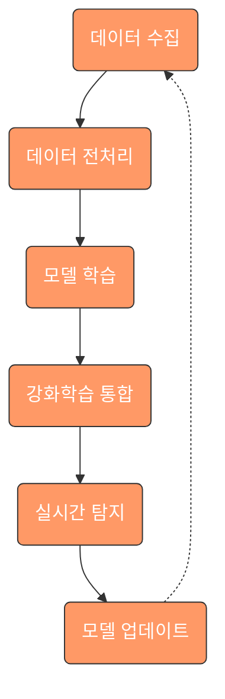
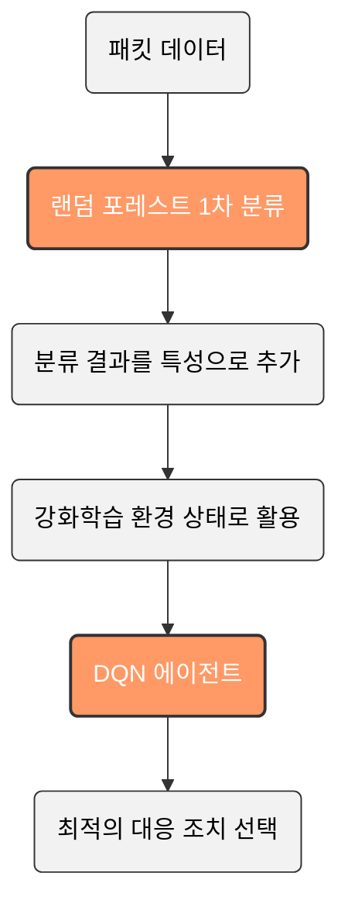
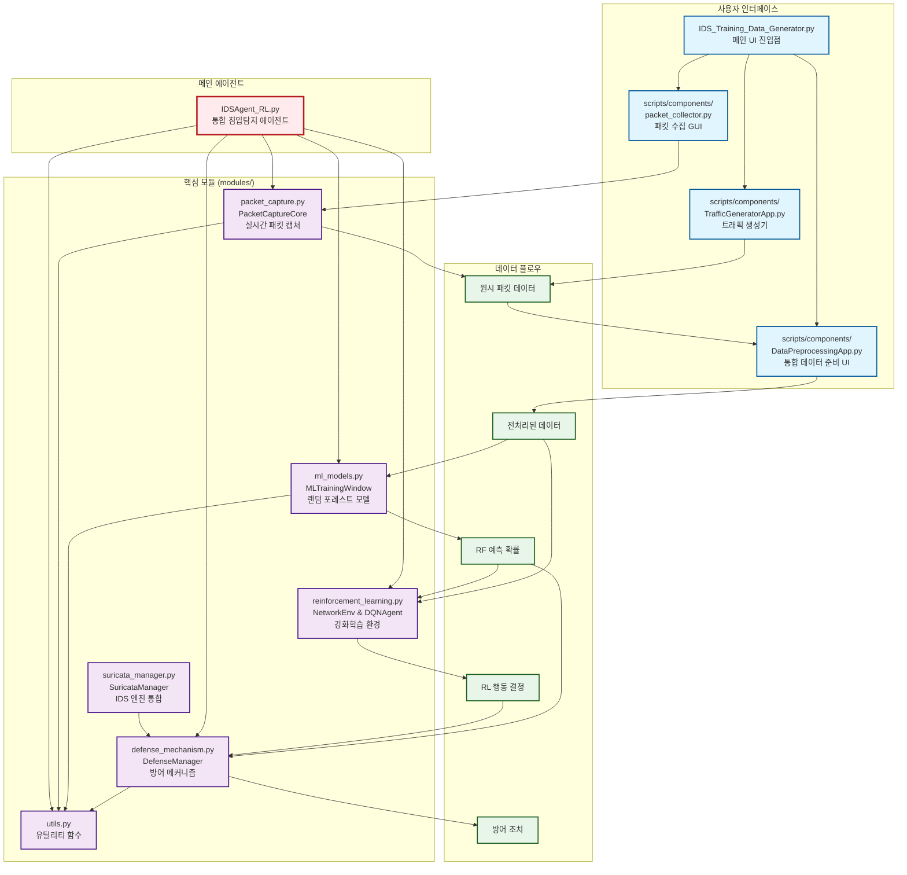
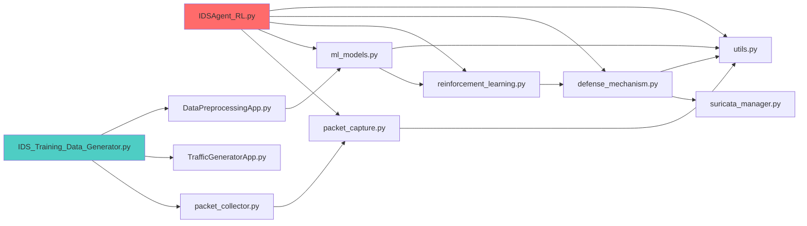
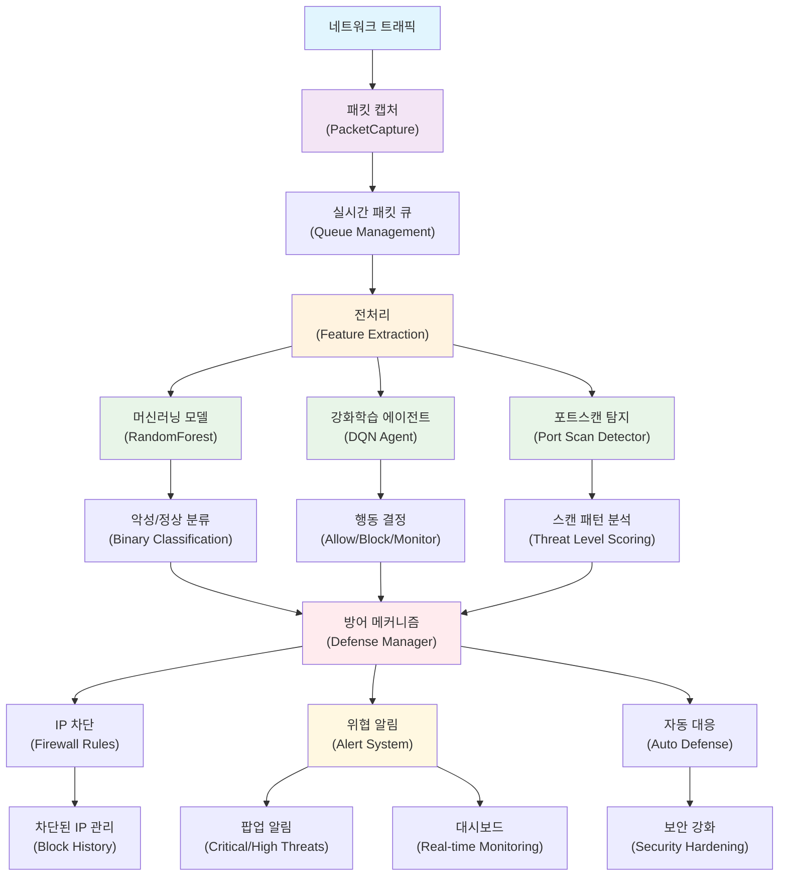
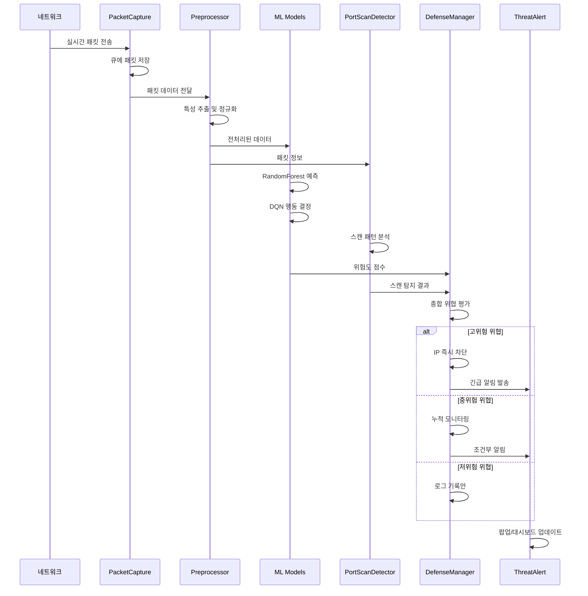
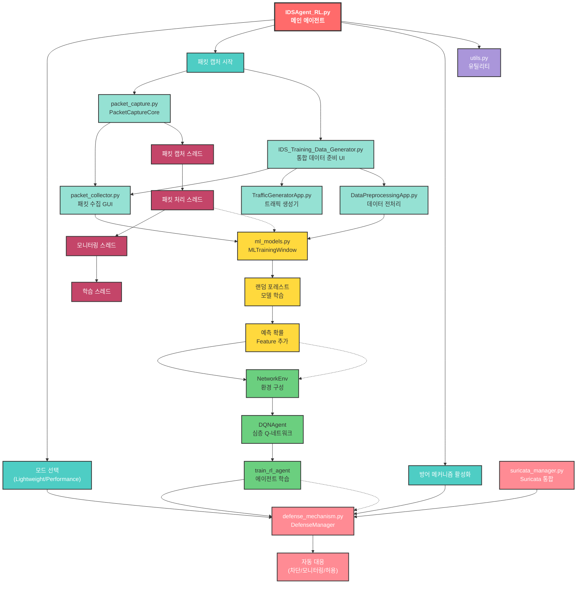

# 🛡️ IDS Agent - 침입 탐지 시스템 (Intrusion Detection System)

<div align="center">
  
  
  
  
</div>

## 0. 목차

1. [프로젝트 개요](#1-프로젝트-개요)
2. [팀원 정보](#2-팀원-정보)
3. [사용개발환경](#3-사용개발환경)
4. [실습 및 테스트 환경](#4-실습-및-테스트-환경)
5. [프로젝트 구조](#5-프로젝트-구조)
6. [사용된 모듈](#6-사용된-모듈)
7. [AI 에이전트 작동 방식](#-ai-에이전트-작동-방식)
8. [하이브리드 접근 방식의 특징](#-하이브리드-접근-방식의-특징)
9. [주요 시스템 구성 요소](#-주요-시스템-구성-요소)
10. [강화학습 관련 클래스 및 메서드](#-강화학습-관련-클래스-및-메서드)
11. [모듈 간 통합 및 데이터 흐름](#-모듈-간-통합-및-데이터-흐름)
12. [전체 시스템 아키텍처](#-전체-시스템-아키텍처)
13. [프로그램 작동법](#-프로그램-작동법)
14. [메모리 최적화 전략](#-메모리-최적화-전략)
15. [운영 모드](#-운영-모드)
16. [향후 개발 계획](#-향후-개발-계획)

## 1. 프로젝트 개요

실시간으로 네트워크 보안 취약점을 탐지하고 자동으로 대응하는 AI 기반 침입 탐지 시스템입니다.   
랜덤 포레스트와 강화학습의 장점을 결합한 하이브리드 접근 방식을 통해 기존 방식보다 높은 정확도와 적응성을 제공합니다.

### 🔐 시스템 핵심 기능 구조

본 시스템은 **5개의 핵심 기능**이 유기적으로 연결되어 동작합니다:

1. **트래픽 캡쳐 (Traffic Capture)** - 실시간 네트워크 패킷 수집
2. **전처리 (Data Preprocessing)** - ML 모델에 적합한 데이터 변환  
3. **학습 (Machine Learning & Reinforcement Learning)** - 하이브리드 AI 모델
4. **포트스캔 탐지 (Port Scan Detection)** - 고급 공격 패턴 분석
5. **후속 대처 (Defense Mechanism & Threat Alert)** - 자동 방어 및 알림

## 2. 팀원 정보

- **안상수[팀장]**: 시스템 설계, 메인프로그래밍
- **신명재[팀원]**: 데이터 학습, 문서작업, 피드백 및 시각화 웹앱 제작
- **민인영[팀원]**: 데이터 학습, 이미지 시각화, 피드백 및 시각화 웹앱 제작
- **최준형[팀원]**: 데이터 학습, 피드백 및 시각화 웹앱 제작

## 3. 사용개발환경

### 프론트엔드
- **IDE**: WebStorm
- **언어**: JavaScript, CSS
- **프레임워크**: React (웹 시각화 대시보드)

### 백엔드 
- **IDE**: PyCharm
- **언어**: Python
- **프레임워크**: Flask (API 서버)

### IDS 프로그램
- **언어**: Python
- **주요 라이브러리**: Scapy, PyTorch, scikit-learn

### 기타 개발도구
- **Google Colab**: 머신러닝 모델 실험 및 훈련
- **VS Code**: 코드 편집 및 디버깅
- **OpenAI Gym**: 강화학습 환경 구축
- **VMware** : 가상환경

## 4. 실습 및 테스트 환경

### STEP 1: 가상머신 설치 및 상태 확인

#### 지원 가상화 플랫폼 및 운영체제

**가상화 플랫폼 지원 현황**

| 가상화 플랫폼 | Windows Host | Linux Host | macOS Host |
|---------------|--------------|------------|------------|
| **VMware Workstation/Fusion** | ✅ 지원 | ✅ 지원 | ✅ 지원 |
| **VirtualBox** | ✅ 지원 | ✅ 지원 | ✅ 지원 |
| **Hyper-V** | ✅ 지원 | ❌ 미지원 | ❌ 미지원 |

**게스트 OS 지원 현황**

| 운영체제 | IDS 시스템 | 침입 테스트 | 용도 |
|----------|------------|-------------|------|
| **Ubuntu 20.04 LTS** | ✅ 최적화 | ✅ 지원 | IDS 메인 시스템 |
| **Kali Linux** | ✅ 지원 | ✅ 최적화 | 침입 테스트 도구 |
| **CentOS/RHEL** | ✅ 지원 | ✅ 지원 | 엔터프라이즈 환경 |
| **Windows 10/11** | ✅ 지원 | ✅ 지원 | 호스트/게스트 겸용 |
| **Debian** | ✅ 지원 | ✅ 지원 | 경량 시스템 |

> **권장 환경**: Ubuntu VM (IDS 시스템용) + Kali Linux VM (침입 테스트용)

#### 가상머신 환경 확인 명령어
1. **가상머신 이름 확인**: `uname -a`
2. **게스트 OS 확인**: `Ubuntu: GNU/Linux [$ uname -o]`
3. **리눅스 배포판 확인**: `Ubuntu [$ uname -r]`

### STEP 2: 테스트베드 주소 정의

| 구분 | SENDER (공격자) | TARGET (방어자) |
|------|----------------|----------------|
| **역할** | 침입 테스트 도구 | IDS 모니터링 대상 |
| **IP 주소** | • 실제 호스트 IP<br/>• VM IP (Kali, Ubuntu, CentOS)<br/>• 루프백 주소<br/>• 클래스 내 인접 PC IP | • 실제 시스템 IP<br/>• VM IP (Kali, Ubuntu, CentOS)<br/>• 루프백 주소<br/>• 클래스 내 인접 PC IP |
| **하드웨어** | 실제 터미널 | 실제 터미널 |
| **네트워크 장비** | 허브, 라우터, 게이트웨이 | |
| **운영체제** | Real Host(Windows)<br/>VM(Kali, Ubuntu, CentOS) | Real Host(Windows)<br/>VM(Kali, Ubuntu, CentOS) |
| **소프트웨어** | **TrafficGeneratorApp.py**<br/>• SYN 플러드<br/>• UDP 플러드<br/>• ARP 스푸핑<br/>• ICMP 리다이렉트<br/>• HTTP Slowloris | **IDSAgent_RL.py**<br/>• 실시간 패킷 캡처<br/>• 머신러닝 탐지<br/>• 강화학습 방어<br/>• 자동 차단 시스템 |

### STEP 3: 실제 테스트 시나리오

#### 기본 테스트 구성
```bash
# SENDER (공격자 VM)
python IDS/scripts/components/TrafficGeneratorApp.py
# 또는 데이터 준비 앱에서 "트래픽 생성" 선택

# TARGET (방어자 VM)  
python IDS/IDSAgent_RL.py
# 또는 데이터 준비 앱에서 "패킷 캡처" 선택
```

#### 네트워크 격리 테스트
- **Host-Only 모드**: 가상머신 간 격리된 네트워크 환경
- **NAT 모드**: 외부 네트워크 접근이 필요한 경우
- **Bridge 모드**: 실제 네트워크와 동일한 환경

#### 테스트 검증 항목
1. **공격 탐지율**: 다양한 공격 패턴에 대한 탐지 성능
2. **오탐률**: 정상 트래픽을 공격으로 잘못 판단하는 비율  
3. **응답 시간**: 공격 탐지부터 방어 조치까지의 시간
4. **자원 사용률**: CPU, 메모리, 네트워크 대역폭 사용량

## 5. 프로젝트 구조

```
📁 Intrusion_DetectionSystem/
│
├── 📄 IDSAgent_RL.py                    # 메인 에이전트 (시스템 핵심)
│
├── 📁 scripts/                          # 실행 스크립트
│   ├── 📄 IDS_Training_Data_Generator.py           # 데이터 준비 인터페이스
│   │
│   └── 📁 components/                   # UI 컴포넌트
│       ├── 📄 packet_collector.py       # 패킷 수집 모듈
│       ├── 📄 TrafficGeneratorApp.py    # 트래픽 생성기
│       └── 📄 DataPreprocessingApp.py   # 데이터 전처리 앱
│
└── 📁 modules/                          # 핵심 기능 모듈
    ├── 📄 reinforcement_learning.py     # 강화학습 구현
    ├── 📄 ml_models.py                  # 머신러닝 모델
    ├── 📄 packet_capture.py             # 패킷 캡처 기능
    ├── 📄 defense_mechanism.py          # 방어 메커니즘 모듈
    ├── 📄 suricata_manager.py           # 수리카타 통합 관리 모듈
    └── 📄 utils.py                      # 유틸리티 함수
```

### IDS 구현 구조
```
📁 IDS/
├── IDSAgent_RL.py          # 메인 에이전트 파일
├── 📁 modules/
│   ├── defense_mechanism.py # 방어 메커니즘 모듈
│   ├── suricata_manager.py  # 수리카타 통합 관리 모듈
│   ├── utils.py             # 유틸리티 함수
│   ├── packet_capture.py    # 패킷 캡처 모듈 
│   ├── reinforcement_learning.py # 강화학습 모듈
│   └── ml_models.py         # 머신러닝 모델 모듈
├── 📁 logs/                    # 로그 디렉토리
├── 📁 data_set/                # 학습 데이터 세트
├── 📁 config/                  # 설정 파일
└── 📁 rules/                   # 수리카타 규칙 파일
```

## 6. 사용된 모듈

### 데이터 분석 모듈
- **pandas(메모리 사용 최적화로 인한 미사용 예정)**
    - 데이터 조작 및 분석을 위한 Python 라이브러리로, DataFrame과 Series 자료구조 제공
    - 패킷 데이터 로드, CSV 파일 처리, 결측치 처리, 범주형 데이터 인코딩 및 데이터 전처리 파이프라인 구축에 활용
- **numpy**
    - 다차원 배열 객체와 수학 함수를 제공하는 과학적 컴퓨팅 라이브러리
    - 패킷 데이터 벡터화, 수치형 특성 정규화, 머신러닝 모델 입력 데이터 변환 및 행렬 연산을 사용

### 머신러닝 관련 모듈
- **scikit-learn**
    - 다양한 머신러닝 알고리즘과 평가 도구를 제공하는 Python 라이브러리
    - 네트워크 패킷 분류를 위한 랜덤 포레스트 모델 구현, 특성 선택, 성능 평가 및 교차 검증에 활용
- **joblib**
    - Python 객체의 직렬화와 병렬 처리를 지원하는 라이브러리
    - 훈련된 랜덤 포레스트 모델을 파일로 저장하고 필요할 때 로드하는 데 사용

### 강화학습 관련 모듈
- **PyTorch**
    - 유연한 딥러닝 프레임워크로 동적 계산 그래프 구축 지원
    - 이 프로젝트에서는 DQN(Deep Q-Network) 구현, 신경망 모델 설계 및 학습에 활용
- **Gym**: 강화학습 환경 구축
    - 강화학습 알고리즘 개발 및 비교를 위한 표준화된 환경 인터페이스 제공
    - 네트워크 환경 모델링, 상태-행동-보상 체계 구현 및 에이전트 훈련에 사용

### 네트워크 및 패킷 캡처 관련 모듈
- **Scapy**: 패킷 캡처, 분석, 생성 및 전송 기능
    - 패킷 조작 및 네트워크 도구를 제공하는 강력한 Python 라이브러리
    - 네트워크 패킷 캡처, 실시간 모니터링, 패킷 분석 및 커스텀 트래픽 생성에 활용

### GUI 관련 모듈
- **PyQt6**: GUI 구현을 위한 Qt 프레임워크의 Python 바인딩
    - Qt 프레임워크의 Python 바인딩으로 크로스 플랫폼 GUI 개발 지원
    - 데이터 시각화 인터페이스, 전처리 도구 UI 및 사용자 대시보드 구현에 사용

##  AI 에이전트 작동 방식



##  하이브리드 접근 방식의 특징

본 시스템은 랜덤 포레스트와 강화학습을 결합한 하이브리드 접근 방식을 사용합니다:



1. **랜덤 포레스트 1차 분류**: 패킷 데이터를 랜덤 포레스트로 1차적으로 분류
2. **랜덤 포레스트 예측 결과 활용**: 분류 결과를 특성(feature)으로 추가
3. **강화학습 환경 통합**: 랜덤 포레스트 예측 결과를 강화학습의 상태(state)로 활용
4. **실시간 대응 의사결정**: DQN 에이전트가 최적의 대응 조치 선택

**장점:**
- 랜덤 포레스트의 높은 분류 정확도 활용
- 강화학습을 통한 동적 환경 적응
- 실시간 의사결정 및 자동화된 대응
- 지속적인 학습을 통한 성능 향상

### 시스템 아키텍처

이 시스템은 랜덤 포레스트 알고리즘과 강화학습(RL)을 결합한 하이브리드 침입 탐지 시스템입니다. 주요 구성 요소:

1. **패킷 캡처 모듈**: 네트워크 인터페이스에서 실시간 패킷 캡처
2. **랜덤 포레스트 모델**: 패킷 분석 및 침입 탐지 수행
3. **강화학습 에이전트**: 탐지된 위협에 대한 최적 대응 결정
4. **방어 메커니즘**: 위협 수준에 따른 자동 대응 조치
5. **수리카타 통합**: 고성능 모드에서 외부 IDS 엔진 활용

##  주요 시스템 구성 요소

### 📦 핵심 모듈별 상세 기능

#### 1. 트래픽 캡쳐 (packet_capture.py)
- **역할**: 네트워크 인터페이스에서 실시간 패킷 캡처
- **기술**: Scapy, Npcap/WinPcap 활용
- **주요 기능**:
  - 실시간 패킷 수집 및 큐 관리
  - 기본 패킷 정보 추출 (IP, 포트, 프로토콜, 플래그)
  - 방어 모듈 콜백 연동
  - 네트워크 인터페이스 자동 탐지

#### 2. 전처리 (preprocessing)
- **역할**: 캡처된 패킷을 ML 모델에 적합한 형태로 변환
- **처리 과정**:
  - 패킷 → 구조화된 데이터 (DataFrame)
  - 특성 추출 및 정규화
  - 모드별 특성 선택 (경량모드: 7개, 고성능모드: 12개)
  - 결측치 처리 및 데이터 타입 최적화

#### 3. 학습 시스템
**A. 머신러닝 (ml_models.py)**
- **모델**: RandomForest Classifier
- **역할**: 기본적인 악성/정상 트래픽 분류
- **특성**: 정적 패턴 학습 및 예측 확률 제공

**B. 강화학습 (reinforcement_learning.py)**
- **모델**: Deep Q-Network (DQN)
- **역할**: 동적 환경 적응 및 행동 결정
- **액션**: 허용(0), 차단(1), 모니터링(2)
- **상태**: 패킷 특성 + RF 예측 확률

#### 4. 포트스캔 탐지 (port_scan_detector.py)
- **역할**: 고급 포트스캔 패턴 분석
- **탐지 기법**:
  - 시간 기반 스캔 패턴 분석
  - 다양한 스캔 타입 분류 (SYN, FIN, NULL, XMAS 등)
  - 위협 수준별 분류 및 점수화
  - 취약점 스캐너 및 보안 강화 기능

#### 5. 후속 대처 시스템
**A. 방어 메커니즘 (defense_mechanism.py)**
- **역할**: 실시간 위협 대응
- **기능**: IP 차단, 트래픽 제어, 자동 방어
- **통합**: 수리카타, 포트스캔 탐지, 위협 알림 시스템

**B. 위협 알림 (threat_alert_system.py)**
- **역할**: 위협 감지 시 관리자 알림
- **기능**: 팝업 알림, 대시보드, 위험도별 알림 전략

### IDSAgent_RL 통합 에이전트 (IDSAgent_RL.py)

`IDSAgent_RL.py`는 이 프로젝트의 핵심 파일로, 모든 모듈을 통합하여 실시간 침입 탐지 및 자동 대응 기능을 제공합니다.

**주요 기능:**
- **통합 인터페이스**: 모든 침입 탐지 및 대응 기능을 단일 인터페이스에서 제공
- **하이브리드 AI**: 랜덤 포레스트 + 강화학습 통합
- **실시간 모니터링**: 멀티스레딩 기반 동시 처리
- **모드별 최적화**: 경량/고성능 모드에 따른 자원 관리

**실행 흐름:**
1. 모드 선택 (Lightweight/Performance)
2. 방어 메커니즘 초기화
3. 패킷 캡처 시작 및 큐 관리
4. ML 모델 로드 및 실시간 예측
5. 강화학습 에이전트 행동 결정
6. 위협 탐지 및 자동 대응
7. 지속적 학습 및 모델 업데이트

###  시스템 통합 포인트

#### 모듈간 연동 방식
- **콜백 기반**: 패킷 캡처 → 방어 메커니즘
- **큐 기반**: 실시간 패킷 처리
- **이벤트 기반**: 위협 탐지 → 알림 시스템

#### 데이터 공유
- JSON 설정 파일로 모듈간 설정 공유
- 로그 파일을 통한 행동 기록
- 메모리 큐를 통한 실시간 데이터 전달

#### 성능 최적화 요소
- **메모리 관리**: 큐 크기 제한, 가비지 컬렉션
- **CPU 최적화**: 청크 단위 처리, 지연 로딩
- **I/O 최적화**: 로그 버퍼링, 배치 처리

### IDS Training Data Generator (IDS_Training_Data_Generator.py)

`IDS_Training_Data_Generator.py`는 데이터 수집, 생성 및 전처리에 필요한 GUI 인터페이스를 제공합니다.

**MainApplication 클래스:**
- 중앙 위젯 및 스택 위젯을 통한 화면 전환 기능
- 메인 화면, 패킷 캡처, 트래픽 생성, 데이터 전처리 등 기능별 인터페이스

### DataPreprocessingApp 클래스

DataPreprocessingApp은 네트워크 패킷 데이터의 전처리와 분석을 위한 사용자 인터페이스를 제공합니다.

**주요 기능:**
- CSV 또는 PCAP 형식의 데이터 파일 로드
- 테이블 형태로 데이터 시각화
- 자동 전처리 기능 (결측치 처리, 정규화, 인코딩)
- 전처리된 데이터의 CSV 형식 저장

**전처리 파이프라인:**
1. 데이터 로드: CSV 또는 PCAP 파일에서 데이터 로드
2. 기본 정보 추출: 소스 IP, 목적지 IP, 프로토콜, 패킷 길이 등 추출
3. 결측치 처리: 결측값을 0으로 대체
4. 데이터 정규화: 수치형 데이터를 표준화
5. 범주형 데이터 인코딩: 프로토콜과 같은 범주형 데이터를 원-핫 인코딩으로 변환
6. 파일 저장: 전처리된 데이터를 CSV 파일로 저장

### TrafficGeneratorApp 클래스

TrafficGeneratorApp은 다양한 유형의 네트워크 트래픽을 생성하고 전송하는 기능을 제공합니다.

**주요 기능:**
- 대상 IP 지정 및 패킷 크기 선택
- 다양한 공격 유형 선택 (SYN 플러드, UDP 플러드, ICMP 플러드 등)
- 생성할 패킷 수 설정
- 트래픽 생성 및 전송

##  강화학습 관련 클래스 및 메서드

### NetworkEnv 클래스

NetworkEnv 클래스는 강화학습을 위한 네트워크 환경을 구현합니다.

**주요 특징:**
- **액션 공간**: 허용(0), 차단(1), 모니터링(2)
- **관찰 공간**: 7개의 특성 [src_ip, dst_ip, protocol, length, ttl, flags, rf_prob]
- **랜덤 포레스트 통합**: 모델의 예측 확률을 상태에 통합
- **보상 시스템**: 패킷의 안전성을 판단하여 보상 계산

### DQNAgent 클래스

DQNAgent 클래스는 심층 Q 네트워크를 구현하여 패킷에 대한 최적의 대응 정책을 학습합니다.

**주요 특징:**
- 신경망 모델 구축
- 경험 리플레이를 사용한 학습 안정화
- 타겟 네트워크를 통한 학습 안정성 향상
- 엡실론-그리디 탐험 전략 적용

**학습 프로세스:**
1. 환경에서 상태 관찰
2. 현재 정책에 따라 액션 선택 (탐험 또는 활용)
3. 액션 실행 및 보상 수집
4. 새로운 상태로 전이
5. 경험 메모리에 저장
6. 경험 리플레이를 통한 모델 업데이트

##  모듈 간 통합 및 데이터 흐름

본 시스템의 데이터 흐름은 IDS 폴더 내의 모듈들이 유기적으로 연동되어 작동합니다:



### 상세 데이터 흐름 프로세스

1. **데이터 수집 단계**:
   - `IDS/scripts/components/packet_collector.py`: GUI를 통한 네트워크 인터페이스 선택 및 패킷 수집 시작
   - `IDS/modules/packet_capture.py`: Scapy를 이용한 실시간 패킷 캡처 엔진
   - `IDS/scripts/components/TrafficGeneratorApp.py`: 테스트용 다양한 유형의 트래픽 생성

2. **데이터 전처리 단계**:
   - `IDS/scripts/components/DataPreprocessingApp.py`: 수집된 원시 패킷 데이터를 ML에 적합한 형태로 변환
   - 특성 추출: IP 주소, 프로토콜, 패킷 길이, TTL, 플래그 등
   - 정규화 및 인코딩 처리

3. **머신러닝 모델 단계**:
   - `IDS/modules/ml_models.py`: 
     - RandomForestClassifier를 이용한 패킷 분류
     - 모델 학습, 평가, 저장 기능
     - 예측 확률값을 강화학습의 입력으로 제공

4. **강화학습 통합 단계**:
   - `IDS/modules/reinforcement_learning.py`:
     - NetworkEnv: 네트워크 환경 시뮬레이션
     - DQNAgent: Deep Q-Network 기반 의사결정
     - 상태(State): 패킷 특성 + RF 예측 확률
     - 행동(Action): 허용(0), 차단(1), 모니터링(2)

5. **방어 메커니즘 단계**:
   - `IDS/modules/defense_mechanism.py`:
     - IP 기반 차단/허용 리스트 관리
     - 위협 레벨별 자동 대응
     - 로깅 및 알림 시스템
   - `IDS/modules/suricata_manager.py`:
     - 고성능 모드에서 Suricata IDS 엔진 통합
     - 규칙 기반 심층 패킷 검사

6. **통합 실행 단계**:
   - `IDS/IDSAgent_RL.py`:
     - 모든 모듈을 통합하여 실시간 침입 탐지 수행
     - 멀티스레딩을 통한 동시 처리
     - 주기적인 모델 업데이트 및 성능 모니터링

###  모듈 간 의존성



##  전체 시스템 아키텍처

### 시스템 데이터 플로우

본 시스템의 데이터 처리 흐름은 다음과 같습니다:



###  핵심 처리 흐름



###  통합 아키텍처

이 프로젝트의 전체 아키텍처는 데이터 수집, 전처리, 학습 및 실시간 적용의 통합된 파이프라인을 형성합니다:



이러한 통합 아키텍처를 통해 데이터 흐름이 원활하게 이루어지며, 각 모듈의 기능이 유기적으로 연결됩니다. 특히 랜덤 포레스트와 강화학습의 통합은 이 시스템의 핵심 특징으로, 두 알고리즘의 장점을 결합하여 더 높은 탐지 성능과 적응성을 제공합니다.

##  프로그램 작동법

### 설치 요구사항

- Python 3.7 이상
- Windows/Linux/MacOS 지원 (Windows에서는 관리자 권한 필요)
- Npcap (Windows) 또는 libpcap (Linux/Mac) 설치 필요
- 고성능 모드의 경우 Suricata 엔진 설치 필요

### 실행 방법(개발 중)

```bash
# 기본 실행 (메뉴에서 모드 선택)
python IDSAgent_RL.py

# 경량 모드로 직접 실행
python IDSAgent_RL.py --mode lightweight

# 고성능 모드로 직접 실행
python IDSAgent_RL.py --mode performance

# 최대 패킷 수 제한 (테스트용)
python IDSAgent_RL.py --max-packets 1000

# 디버그 모드 실행
python IDSAgent_RL.py --debug
```

### 데이터 준비 애플리케이션 (DataPreprocessingApp)

1. **데이터 파일 업로드**:
   - 'IDS_Training_Data_Generator.py'를 실행하여 메인 메뉴에 접근
   - '데이터 전처리' 버튼을 클릭하여 DataPreprocessingApp 실행
   - '데이터 파일 업로드' 버튼으로 CSV 또는 PCAP 파일 선택
   - 데이터는 자동으로 테이블에 로드되어 표시됨

2. **데이터 전처리**:
   - '데이터 전처리' 버튼 클릭
   - 결측치 처리, 정규화, 인코딩 등의 과정이 자동 수행됨
   - 전처리 결과 표시 및 저장 옵션 제공
   - 저장 위치 선택 후 CSV 형식으로 저장

### 침입 탐지 에이전트 (IDSAgent_RL)

1. **환경 확인**: Google Colab 환경과 로컬 환경에서 다르게 작동
2. **관리자 권한 실행**: Windows 환경에서는 관리자 권한으로 실행
3. **패킷 캡처**: 네트워크 인터페이스 선택 및 캡처 시작
4. **실시간 모니터링**: 패킷 캡처 상태와 정보를 실시간으로 모니터링
5. **데이터 저장 및 전처리**: 패킷 데이터 주기적 저장 및 전처리
6. **머신러닝 모델 학습**: 전처리된 데이터로 모델 학습 및 평가

### 트래픽 생성 (TrafficGeneratorApp)

1. **공격성 패킷 생성**:
   - 'IDS_Training_Data_Generator.py'에서 '트래픽 생성' 버튼 클릭
   - 공격 대상 IP 입력
   - 패킷 크기 및 유형 선택
   - 생성할 패킷 수 설정
   - '생성 시작' 버튼으로 트래픽 생성 및 전송

##  메모리 최적화 전략

대용량 패킷 처리를 위한 메모리 최적화 기법:

1. **청크 기반 처리**: 패킷을 1000개에서 200개 단위로 나누어 처리
2. **데이터 타입 최적화**: 
   - int64 → int32 
   - 불필요한 object 타입 최소화
3. **선택적 컬럼 처리**: 필요한 컬럼만 선택적으로 메모리에 로드
4. **명시적 메모리 관리**: 
   - 사용 완료된 데이터프레임 명시적 삭제
   - 주기적 가비지 컬렉션 호출
5. **버퍼 크기 제한**: 최대 버퍼 크기를 제한하여 메모리 누수 방지

6. **C와 파이썬의 하이브리드 방식으로 구동(고려중)**
    - 패킷 캡쳐/분석 부분만 C로 구현하여


##  운영 모드

시스템은 두 가지 운영 모드를 지원합니다:

### 1. 경량 모드 (Lightweight)
- **특성**: 7개 기본 특성 사용 (IP 주소, 프로토콜, 패킷 길이, TTL, 플래그, RF 예측값)
- **리소스**: 낮은 CPU/메모리 사용
- **정확도**: 기본 수준의 탐지 성능
- **대상**: 모든 환경에서 실행 가능
- **탐지 방식**: 내장 휴리스틱 기반 탐지

### 2. 고성능 모드 (Performance)
- **특성**: 12개 확장 특성 (기본 7개 + 수리카타 5개)
- **리소스**: 높은 CPU/메모리 사용
- **정확도**: 향상된 탐지 정확도
- **대상**: 고사양 시스템 전용
- **탐지 방식**: 수리카타(Suricata) 엔진 통합 + 규칙 기반 심층 분석

###  위험도별 대응 전략

#### 위협 수준별 자동 대응 체계

| 위험도 | 임계값 | 대응 조치 | 알림 방식 |
|--------|--------|-----------|-----------|
| **치명적** | 0.95+ | • 즉시 IP 차단<br/>• 관리자 이메일 발송<br/>• 긴급 로그 기록 | 즉시 팝업 알림 |
| **높음** | 0.85+ | • 즉시 차단 + 알림<br/>• 상세 로그 기록 | 즉시 팝업 알림 |
| **중간** | 0.70+ | • 5분간 5회 누적 시에만 알림<br/>• 임시 차단 (자동 해제) | 조건부 알림 |
| **낮음** | 0.50+ | • 모니터링만 수행<br/>• 기본 로그 기록 | 알림 없음 |

##  향후 개발 계획

###  단기 개발 계획 (1-3개월)
- **성능 최적화**: 핵심 병목 구간(패킷 캡쳐/분석) C언어 변경 고려 (Cython 활용)
- **백그라운드 실행**: 시스템 서비스로 백그라운드 동작 구현
- **UI/UX 개선**: 실시간 대시보드 및 모니터링 인터페이스 고도화
- **알림 시스템 확장**: 이메일, SMS, 슬랙 등 다양한 알림 채널 지원

### 🔬 중기 개발 계획 (3-6개월)
- **강화학습 고도화**: PPO(Proximal Policy Optimization) 알고리즘 구현
- **다중 환경 적응**: 다양한 네트워크 환경에서의 적응성 향상
- **분산 학습**: 클라우드 연동 분산 학습 시스템 구축
- **시각화 시스템**: 학습 및 차단 트래픽 데이터 실시간 시각화

###  장기 개발 계획 (6개월 이상)
- **AI 모델 확장**: 
  - Transformer 기반 시퀀스 분석 모델 도입
  - 그래프 신경망(GNN)을 통한 네트워크 토폴로지 분석
- **제로데이 공격 탐지**: 알려지지 않은 공격 패턴 탐지 능력 강화
- **자동화 확장**: 
  - 자동 규칙 생성 시스템
  - 적응형 임계값 조정 메커니즘
- **엔터프라이즈 기능**:
  - 중앙집중식 관리 콘솔
  - 다중 사이트 모니터링
  - 규정 준수 및 감사 로그 시스템

###  연구 개발 방향
- **사용자 피드백 기반 성능 개선**: 실사용 데이터를 통한 지속적 학습
- **실시간 대응 메커니즘 고도화**: 마이크로초 단위 대응 시간 목표
- **경량화 연구**: IoT 환경을 위한 초경량 IDS 버전 개발