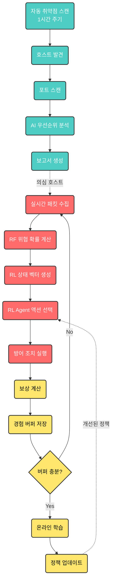
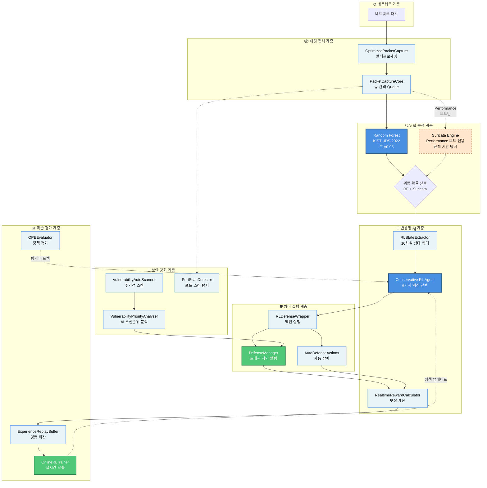
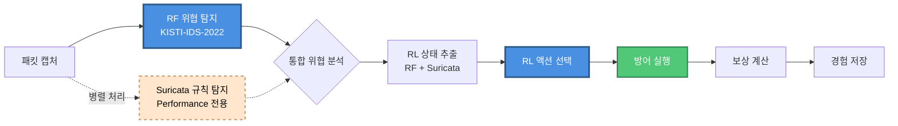
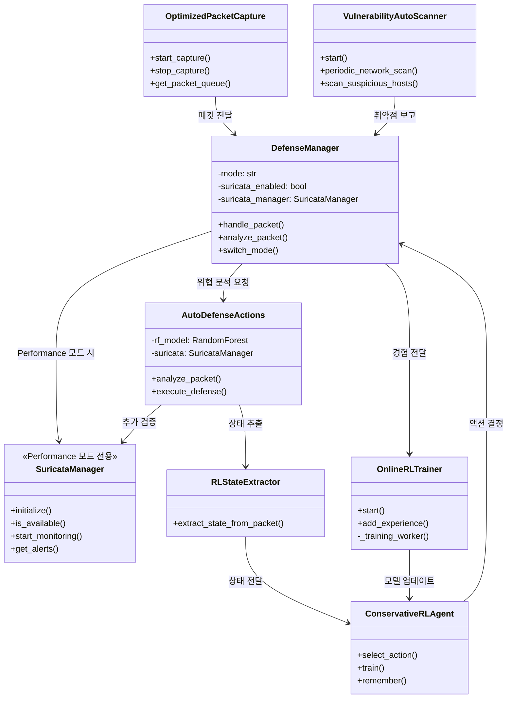
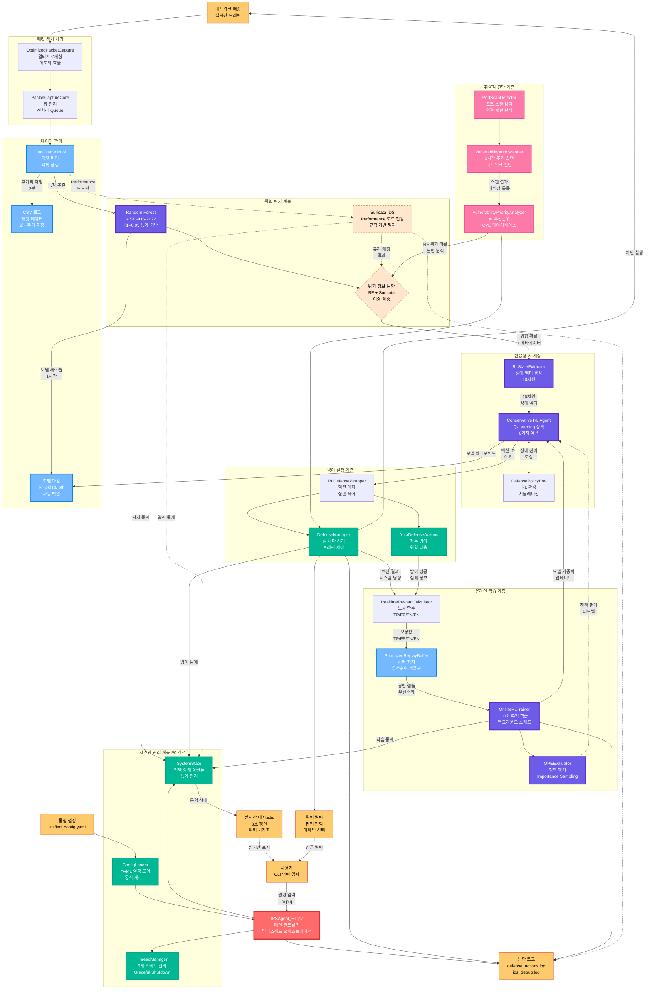

# 반응형 AI 에이전트를 이용한 취약점 자동진단 시스템

<div align="center">
  
  
  
  
  
  
</div>

## 목차

1. [프로젝트 개요](#프로젝트-개요)
2. [프로그램 시작 및 사용법](#프로그램-시작-및-사용법)
3. [사용개발환경](#사용개발환경)
4. [실습 및 테스트 환경](#실습-및-테스트-환경)
5. [프로젝트 구조](#프로젝트-구조)
6. [사용된 모듈](#사용된-모듈)
7. [AI 에이전트 작동 방식](#ai-에이전트-작동-방식)
8. [하이브리드 접근 방식의 특징](#하이브리드-접근-방식의-특징)
9. [주요 시스템 구성 요소](#주요-시스템-구성-요소)
10. [강화학습 관련 클래스 및 메서드](#강화학습-관련-클래스-및-메서드)
11. [모듈 간 통합 및 데이터 흐름](#모듈-간-통합-및-데이터-흐름)
12. [전체 시스템 아키텍처](#전체-시스템-아키텍처)
13. [메모리 최적화 전략](#메모리-최적화-전략)
14. [운영 모드](#운영-모드)


## 프로젝트 개요

**반응형 AI 에이전트**가 실시간으로 네트워크 위협을 탐지하고, 지능적으로 대응하며, 자동으로 취약점을 진단하는  보안 시스템입니다.

Random Forest 기반 **실시간 위협 탐지**와 Conservative RL 기반 **지능형 자동 대응**, 그리고 주기적 **취약점 자동 스캐닝**을 통해 네트워크를 포괄적으로 보호합니다.


###  시스템 3대 핵심 기능

#### **1️⃣ 반응형 AI 에이전트 (Reactive AI Agent)**
- **실시간 위협 대응**: RF 탐지 결과를 받아 RL 에이전트가 즉각 액션 선택
- **온라인 학습**: 실시간 경험을 버퍼에 축적하고 주기적으로 학습
- **지능형 의사결정**: 상황을 고려한 6단계 대응 액션 (허용~격리)
- **보상 기반 개선**: 대응 결과에 따른 보상으로 정책 지속 개선

#### **2️⃣ 취약점 자동진단 (Automated Vulnerability Assessment)**
- **주기적 자동 스캔**: 1시간마다 전체 네트워크 자동 스캔
- **의심 호스트 빠른 진단**: 10분마다 의심스러운 호스트 재스캔
- **AI 기반 우선순위 분석**: 취약점의 실제 위험도 자동 평가
- **자동 보고서 생성**: 스캔 결과 자동 분석 및 리포트 작성

#### **3️⃣ 통합 보안 파이프라인 (Integrated Security Pipeline)**
- **RF 위협 탐지**: KISTI-IDS-2022 기반 현실적 탐지 (F1=0.95)
- **RL 대응 정책**: Conservative Q-Learning 기반 안전한 자동 대응
- **실시간 방어**: IP 차단, 트래픽 제어, 세션 격리
- **멀티스레드 처리**: 6개 백그라운드 스레드 동시 운영

## 프로그램 시작 및 사용법

###  빠른 시작 (다른 컴퓨터에서 처음 실행 시)

**1단계: 프로젝트 다운로드**
```bash
git clone <repository_url>
cd Intrusion_DetectionSystem
```

**2단계: 시스템 진단 (필수!)**
```bash
# 관리자 권한으로 진단 스크립트 실행
python IDS/system_diagnostic.py
```
이 스크립트가 자동으로 환경을 체크하고 문제를 알려줍니다!

**3단계: 자동 수정 (문제 발견 시)**
```bash
# Windows (관리자 권한 필수)
fix_system.bat

# Linux/Mac
sudo ./setup_and_run.sh
```

**4단계: IPS 시스템 실행**
```bash
# Windows (관리자 권한 필수)
python IDS/IPSAgent_RL.py

# Linux/Mac
sudo python IDS/IPSAgent_RL.py
```

---

### 설치 요구사항

- **Python**: 3.8 이상 (권장 3.9+)
- **운영체제**: Windows 10+, Linux (Ubuntu 18.04+), macOS 10.15+
- **권한**: Windows에서는 관리자 권한 필요
- **네트워크**: Npcap (Windows) 또는 libpcap (Linux/Mac) 설치 필요
- **고급 기능**: 고성능 모드를 위한 Suricata 엔진 (선택사항)
- **메모리**: 400MB 이상 RAM  (고성능 모드는 1GB 권장)

### 의존성 설치

```bash
# pip 업그레이드
python -m pip install --upgrade pip

# 필수 패키지 설치
pip install colorama pandas numpy scikit-learn torch joblib scapy matplotlib seaborn tqdm psutil

# 또는 requirements.txt 사용
pip install -r IDS/requirements.txt
```

### 환경별 추가 설정

#### Windows
- **Npcap 설치**: [공식 웹사이트](https://npcap.com/#download)에서 다운로드
- **관리자 권한**: 프로그램 실행 시 자동으로 관리자 권한 요청

#### Linux/Mac
```bash
# libpcap 설치
sudo apt-get install libpcap-dev  # Ubuntu/Debian
sudo yum install libpcap-devel     # CentOS/RHEL
brew install libpcap               # macOS

# 권한 설정 (선택사항)
sudo setcap cap_net_raw+ep /usr/bin/python3
```

### 실행 방법

#### 자동 설치 및 실행

**Windows 사용자**
```bash
# 관리자 권한으로 명령 프롬프트 실행 후
setup_and_run.bat
```

**Linux/Unix/macOS 사용자**
```bash
# 실행 권한 부여 (최초 1회)
chmod +x setup_and_run.sh

# 실행
sudo ./setup_and_run.sh
```

#### 수동 실행

**기본 실행**
```bash
# 1. 의존성 패키지 설치
pip install -r requirements.txt

# 2. IPS Agent 실행
cd IDS
python IPSAgent_RL.py
```

**명령줄 옵션**
```bash
python IPSAgent_RL.py --mode lightweight    # 경량 모드
python IPSAgent_RL.py --mode performance    # 고성능 모드
python IPSAgent_RL.py --no-menu             # 메뉴 없이 기본 모드로 실행
python IPSAgent_RL.py --max-packets 1000    # 최대 패킷 수 제한
python IPSAgent_RL.py --debug               # 디버그 모드 실행
```

### CLI 인터페이스

#### 시작 화면

프로그램을 실행하면 ASCII 로고와 함께 컬러풀한 인터페이스가 시작됩니다:

```
================================================================================
    ██╗██████╗ ███████╗     █████╗  ██████╗ ███████╗███╗   ██╗████████╗
    ██║██╔══██╗██╔════╝    ██╔══██╗██╔════╝ ██╔════╝████╗  ██║╚══██╔══╝
    ██║██║  ██║███████╗    ███████║██║  ███╗█████╗  ██╔██╗ ██║   ██║   
    ██║██║  ██║╚════██║    ██╔══██║██║   ██║██╔══╝  ██║╚██╗██║   ██║   
    ██║██████╔╝███████║    ██║  ██║╚██████╔╝███████╗██║ ╚████║   ██║   
    ╚═╝╚═════╝ ╚══════╝    ╚═╝  ╚═╝ ╚═════╝ ╚══════╝╚═╝  ╚═══╝   ╚═╝   

           지능형 침입 방지 시스템 (IPS Agent)
                    강화학습 & 머신러닝 기반
                    KISTI-IDS-2022 데이터셋 지원
================================================================================
```

#### 모드 선택 메뉴

사용자 친화적인 모드 선택 인터페이스가 제공됩니다:

**1. 경량 모드 (Lightweight Mode)**
-  일반 사용자, 제한된 시스템 자원 환경
- 빠른 실행 속도
- 낮은 메모리 사용량
- 기본 특성 7개 사용


**2. 고성능 모드 (Performance Mode)**
-  고사양 시스템 환경
- 수리카타(Suricata) 엔진 통합
- 확장 특성 12개 사용
- 더 높은 정확도의 탐지
- 더 많은 시스템 자원 필요

#### 실행 중 명령어 인터페이스

프로그램 실행 중 다음과 같은 명령어를 사용할 수 있습니다:

| 명령어 | 단축키 | 설명 |
|--------|--------|------|
| `help` | `h` | 도움말 표시 |
| `status` | `s` | 시스템 상태 확인 |
| `packets` | `p` | 패킷 통계 표시 |
| `defense` | `d` | 방어 메커니즘 상태 |
| `ml` | - | 머신러닝 모델 상태 |
| `threats` | `t` | 위협 탐지 상세 통계 |
| `mode` | `m` | 운영 모드 전환 |
| `quit` | `q` | 프로그램 종료 |

#### 실시간 대시보드

시스템은 3초마다 업데이트되는 실시간 대시보드를 제공합니다:

- **시스템 상태**: 가동시간, 운영모드, 인터페이스 정보
- **패킷 캡처 통계**: 총 캡처 수, 초당 패킷 수, 최고 처리량
- **프로토콜 분석**: TCP, UDP, ICMP 등 프로토콜별 통계(미완성)
- **위협 탐지 현황**: 위험도별 탐지 결과
- **방어 조치 현황**: 차단된 IP, 모니터링 대상(미완성성)
- **AI/ML 엔진 상태**: 예측 수행, 모델 정확도, 업데이트 횟수(미완성)

## 실습 및 테스트 환경

### 가상머신 설치 및 상태 확인

#### 테스트용 가상화 플랫폼

**가상화 플랫폼**

| 가상화 플랫폼 | Windows Host | Linux Host  |
|---------------|--------------|------------------------|
| **VMware Workstation** | 지원 | 지원  |

**테스트 사용 OS**

| 운영체제 | IDS 시스템 | 침입 테스트 | 용도 |
|----------|------------|-------------|------|
| **Ubuntu 20.04 LTS** | 최적화 | 지원 | IDS 메인 시스템 |
| **Kali Linux** | 지원 | 최적화 | 침입 테스트 도구 |
| **Windows 11** | 지원 | 지원 | 호스트/게스트 겸용 |

**권장 환경**: Ubuntu VM (IDS 시스템용) + Kali Linux VM (침입 테스트용)


### 테스트베드 주소 정의

| 구분 | SENDER (공격자) | TARGET (방어자) |
|------|----------------|----------------|
| **역할** | 침입 테스트 도구 | IDS 모니터링 대상 |
| **IP 주소** | 실제 호스트 IP, VM IP (Kali, Ubuntu, CentOS), 루프백 주소, 클래스 내 인접 PC IP | 실제 시스템 IP, VM IP (Kali, Ubuntu, CentOS), 루프백 주소, 클래스 내 인접 PC IP |
| **하드웨어** | 실제 터미널 | 실제 터미널 |
| **네트워크 장비** | 허브, 라우터, 게이트웨이 | |
| **운영체제** | Real Host(Windows), VM(Kali, Ubuntu, CentOS) | Real Host(Windows), VM(Kali, Ubuntu, CentOS) |
| **소프트웨어** | **TrafficGeneratorApp.py** (SYN 플러드, UDP 플러드, ARP 스푸핑, ICMP 리다이렉트, HTTP Slowloris), Kali Linux| **IPSAgent_RL.py** (실시간 패킷 캡처, 머신러닝 탐지, 강화학습 방어, 자동 차단 시스템) |

### 실제 테스트 시나리오

#### 기본 테스트 구성
```bash
# SENDER (공격자 VM)
python IDS/scripts/components/TrafficGeneratorApp.py

# TARGET (방어자 VM)  
python IDS/IPSAgent_RL.py
```

#### 네트워크 격리 테스트
- **Host-Only 모드**: 가상머신 간 격리된 네트워크 환경
- **NAT 모드**: 외부 네트워크 접근이 필요한 경우
- **Bridge 모드**: 실제 네트워크와 동일한 환경

#### 테스트 검증 항목
1. **공격 탐지율**: 다양한 공격 패턴에 대한 탐지 성능
2. **오탐률**: 정상 트래픽을 공격으로 잘못 판단하는 비율  
3. **응답 시간**: 공격 탐지부터 방어 조치까지의 시간
4. **자원 사용률**: CPU, 메모리, 네트워크 대역폭 사용량

## 프로젝트 구조

현재 실제 구조에 따른 프로젝트 디렉토리 구성:

```
Intrusion_DetectionSystem/
├── README.md                        # 프로젝트 설명서
├── requirements.txt                 # Python 의존성 목록 (PyYAML, pytest 포함)
├── setup_and_run.bat               # Windows 설치 및 실행 스크립트
├── SURICATA_INSTALLATION_GUIDE.md  # Suricata 설치 가이드
│
├── docs/                           # 시스템 문서
│   ├── IDS_웹시스템_설계서.md       # 웹 시스템 설계 문서
│   ├── implementation_strategy.md  # 구현 전략
│   ├── memory_optimization.md      # 메모리 최적화 가이드
│   └── 네트워크_시뮬레이션_설계서.md # 네트워크 시뮬레이션 설계
│
├── IDS/                            # 핵심 IPS 시스템
│   ├── IPSAgent_RL.py              #  메인 IPS 에이전트 (1925줄)
│   ├── ips_pipeline_integrator.py  # RF-RL 통합 파이프라인
│   ├── IPS_Training_Data_Generator.py # GUI 데이터 준비 인터페이스
│   │
│   ├── 머신러닝 모델 파일/
│   │   ├── kisti_random_forest_model.pkl #  KISTI-IDS-2022 RF 모델 (F1=0.95)
│   │   ├── ips_random_forest_model.pkl   # CIC-IDS-2017 RF 모델 (참고용)
│   │   ├── defense_policy_agent.pth      # Conservative RL 에이전트 모델
│   │   └── ips_rf_trainer.py             # RF 모델 훈련 스크립트
│   │
│   ├── 설정 파일/
│   │   ├── defense_config.json          # 방어 메커니즘 설정 (레거시)
│   │   ├── security_alerts.json         # 보안 알림 설정 (레거시)
│   │   ├── blocked_ips_history.json     # 차단된 IP 히스토리
│   │   └── config/
│   │       └── unified_config.yaml      #  통합 설정 파일 (P1 개선)
│   │
│   ├── KISTI 데이터 처리 시스템/
│   │   ├── kisti_data_processor.py      # KISTI 데이터 전처리기
│   │   ├── kisti_data_visualizer.py    # KISTI 데이터 시각화
│   │   └── kisti_quick_sampler.py      # KISTI 빠른 샘플링
│   │
│   ├── modules/                        # 🔧 핵심 기능 모듈 (25개)
│   │   ├── __init__.py                  # 모듈 통합 및 export 관리
│   │   │
│   │   ├── 핵심 모듈 (필수)/
│   │   │   ├── defense_mechanism.py     # 실시간 방어 메커니즘
│   │   │   ├── ml_models.py            # Random Forest 모델 관리
│   │   │   ├── packet_capture.py       # 패킷 캡처 코어
│   │   │   ├── optimized_packet_capture_simple.py # 최적화 패킷 캡처
│   │   │   ├── port_scan_detector.py   # 포트 스캔 및 취약점 탐지
│   │   │   └── utils.py                # 유틸리티 함수
│   │   │
│   │   ├── Conservative RL 시스템 (반응형 AI 핵심)/
│   │   │   ├── conservative_rl_agent.py # Conservative Q-Learning 에이전트
│   │   │   ├── defense_policy_env.py   # RL 환경 (6가지 액션)
│   │   │   ├── ope_evaluator.py        # Off-Policy Evaluation
│   │   │   └── experience_replay_buffer.py # 우선순위 경험 버퍼
│   │   │
│   │   ├── 반응형 AI 통합 모듈 (자동 취약점 진단)/
│   │   │   ├── rl_state_extractor.py        # RL 상태 추출기 (10차원)
│   │   │   ├── realtime_reward_calculator.py # 실시간 보상 계산기
│   │   │   ├── online_rl_trainer.py         # 온라인 RL 학습 스레드
│   │   │   ├── rl_defense_wrapper.py        # RL 방어 래퍼
│   │   │   ├── vulnerability_auto_scanner.py # 자동 취약점 스캐너
│   │   │   └── vulnerability_priority_analyzer.py # AI 우선순위 분석
│   │   │
│   │   ├── 시스템 관리 모듈 (P0 개선)/
│   │   │   ├── system_state.py         # 전역 상태 관리 (싱글톤)
│   │   │   ├── thread_manager.py       # 스레드 생명주기 관리
│   │   │   ├── ips_agent.py           # IPS 에이전트 클래스
│   │   │   └── config_loader.py       # YAML 설정 로더 (P1)
│   │   │
│   │   ├── 최적화 및 성능/
│   │   │   ├── lazy_loading.py         # 지연 로딩 시스템
│   │   │   ├── memory_optimization.py  # 메모리 최적화
│   │   │   └── model_optimization.py   # 모델 최적화
│   │   │
│   │   └── 선택적 모듈/
│   │       ├── suricata_manager.py     # Suricata 엔진 통합
│   │       ├── reinforcement_learning.py # 레거시 RL (호환용)
│   │       └── threat_alert_system.py  # 레거시 알림 (통합됨)
│   │
│   ├── 테스트 및 벤치마크/
│   │   ├── test_system_management.py  # P0/P1 시스템 통합 테스트
│   │   ├── test_reactive_ai_system.py # 반응형 AI 통합 테스트
│   │   ├── test_model_integration.py  # 모델 통합 테스트
│   │   ├── benchmark_rl_performance.py # RL 성능 벤치마크
│   │   ├── test_experience_replay.py  # 경험 리플레이 버퍼 테스트
│   │   └── tests/                     # pytest 단위 테스트
│   │       ├── __init__.py
│   │       └── test_system_state.py   # SystemState 단위 테스트
│   │
│   ├── scripts/
│   │   └── components/            # 스크립트 컴포넌트 (3개 파일)
│   │       ├── TrafficGeneratorApp.py # 트래픽 생성기 (공격 시뮬레이션)
│   │       ├── packet_collector.py # 패킷 수집 GUI
│   │       └── DataPreprocessingApp.py # 데이터 전처리 앱
│   │
│   ├── processed_data/            # CIC-IDS-2017 + KISTI 전처리 데이터
│   │   ├── CIC-IDS-2017 데이터/
│   │   │   ├── cic_ids_2017_train.csv # 학습 데이터 (387K 샘플)
│   │   │   ├── cic_ids_2017_val.csv   # 검증 데이터 (55K 샘플)
│   │   │   ├── cic_ids_2017_test.csv  # 테스트 데이터 (111K 샘플)
│   │   │   └── rf_evaluation_results.json # RF 성능 평가 결과
│   │   ├── KISTI 데이터/ 
│   │   │   ├── kisti_quick_train.csv  # KISTI 훈련 데이터
│   │   │   ├── kisti_quick_test.csv   # KISTI 테스트 데이터
│   │   │   ├── kisti_quick_val.csv    # KISTI 검증 데이터
│   │   │   ├── kisti_data_analysis.png # KISTI 데이터 분석 차트
│   │   │   ├── kisti_detailed_analysis.png # KISTI 상세 분석
│   │   │   ├── kisti_network_behavior.png # KISTI 네트워크 행동 분석
│   │   │   └── kisti_statistics_report.txt # KISTI 통계 보고서
│   │   ├── class_weights.json     # 클래스 가중치
│   │   ├── dataset_summary.json   # 데이터셋 요약 정보
│   │   └── feature_names.json     # 특성 이름 목록
│   │
│   ├── captured_packets_*.csv     # 실시간 캡처된 패킷 파일들 (7개) 
│   └── logs/                      # IPS 로그 파일 저장소
│       ├── ips_debug.log          # 디버그 로그
│       └── defense_actions.log    # 방어 조치 로그
│
├── CIC-IDS- 2017/                 # CIC-IDS-2017 원본 데이터셋
│   ├── Monday-WorkingHours.pcap_ISCX.csv
│   ├── Tuesday-WorkingHours.pcap_ISCX.csv
│   ├── Wednesday-workingHours.pcap_ISCX.csv
│   ├── Thursday-WorkingHours-Morning-WebAttacks.pcap_ISCX.csv
│   ├── Thursday-WorkingHours-Afternoon-Infilteration.pcap_ISCX.csv
│   ├── Friday-WorkingHours-Morning.pcap_ISCX.csv
│   ├── Friday-WorkingHours-Afternoon-PortScan.pcap_ISCX.csv
│   └── Friday-WorkingHours-Afternoon-DDos.pcap_ISCX.csv
│
├── data_set/                      # 훈련 데이터셋
│   └── training_set.csv
│
├── docs/                          # 문서 및 설계서
│   └── 네트워크_시뮬레이션_설계서.md
│
└── logs/                          # 전역 로그 디렉토리
    ├── ids_debug.log             # 시스템 디버그 로그
    └── defense_actions.log       # 방어 조치 이력
```

### 주요 실행 파일

| 파일명 | 역할 | 모드 | 설명 |
|--------|------|------|------|
| **IPSAgent_RL.py** | 메인 IPS 시스템 | CLI | 실시간 침입 방지 및 방어 (실제 운영용) - 1925줄  |
| **modules/ips_agent.py** | IPS 에이전트 클래스 | API | IPSAgent 클래스 - main() 함수 리팩토링 |
| **IPS_Training_Data_Generator.py** | 데이터 준비 통합 GUI | GUI | 패킷 캡처, 트래픽 생성, 데이터 전처리 통합 인터페이스 (개발/테스트용) |
| **ips_pipeline_integrator.py** | RF-RL 통합 파이프라인 | API | 위협 탐지부터 대응까지 전체 파이프라인 관리 |
| **kisti_random_forest_model.pkl** | KISTI RF 모델 | Model | KISTI-IDS-2022 기반 현실적 성능 모델 (F1=0.95) 

### 패킷 캡처 시스템 구조

**우선순위 기반 패킷 캡처:**
1. `optimized_packet_capture_simple.py` (현재 사용)
2. `optimized_packet_capture.py` (백업)
3. `packet_capture.py` (기본)

### 메모리 최적화 시스템

**최적화 모듈:**
- `memory_optimization.py` - 객체 풀링 (패킷/DataFrame 재사용)
- `lazy_loading.py` - 지연 로딩 (125-195MB 메모리 절약)
- `experience_replay_buffer.py` - 우선순위 기반 학습 버퍼

### IDS 에이전트 핵심 구조

**IPSAgent_RL.py**는 모든 모듈을 통합한 메인 실행 파일로 다음과 같은 구조를 가집니다:

- **멀티스레드 아키텍처**: 6개의 백그라운드 스레드 동시 실행
  - 실시간 대시보드 표시 스레드
  - 패킷 처리 및 저장 스레드  
  - 시스템 모니터링 스레드
  - 머신러닝 모델 학습 스레드
  - 사용자 입력 처리 스레드
  - **반응형 AI 통합 서비스** (온라인 RL 학습 + 취약점 스캔) 

- **운영 모드**: Lightweight(경량) / Performance(고성능) 동적 전환
- **실시간 위협 분석**: RF 모델 + RL 에이전트 통합 분석
- **자동 대응 시스템**: 6단계 지능형 대응 (허용~격리)
- **시스템 관리**: SystemState + ThreadManager를 통한 중앙 관리 

## 사용된 라이브러리

### 데이터 분석 모듈
- **pandas**
- **numpy**

### 머신러닝 관련 모듈
- **scikit-learn**
- **joblib**

### 강화학습 관련 모듈
- **PyTorch**
- **Gym**

### 네트워크 및 패킷 캡처 관련 모듈
- **Scapy**


### 기타 모듈
- **colorama**
- **tqdm**
- **psutil**
- **matplotlib/seaborn**

##  반응형 AI 시스템 작동 방식



###  통합 에이전트 작동 흐름

**IPSAgent_RL.py**는 6개 멀티스레드 백그라운드 처리로 작동합니다:

#### **1단계: 시스템 초기화**
- 운영 모드 선택 (Lightweight/Performance)
- 관리자 권한 확인 (Windows)
- KISTI RF 모델 + Conservative RL 에이전트 로드
- 자동 취약점 스캐너 시작 (1시간 주기)
- 방어 메커니즘 초기화 (RL 통합)

#### **2단계: 6개 백그라운드 스레드**
1. **실시간 대시보드**: 3초마다 화면 업데이트
2. **패킷 처리 및 저장**: 50-2000개 적응형 처리
3. **시스템 모니터링**: 10분마다 상세 로깅
4. **머신러닝 모델 학습**: 데이터 축적 시 RF 모델 재학습
5. **사용자 입력 처리**: 실시간 명령어 대기
6. **반응형 AI 통합 서비스**: 온라인 RL 학습 (10초 주기) + 자동 취약점 스캔 (1시간 주기)  NEW

#### **3단계: RF 위협 탐지 (특징 추출기 역할)**
- 실시간 패킷 → 위협 확률 계산 (0.0~1.0)
- 빠른 필터링: 확률 < 0.3 → 즉시 허용
- RL 상태 입력으로 전달

#### **4단계: RL 지능형 대응 (주 의사결정자)**
```python
state = [
    threat_probability,  # RF가 제공 (0.85)
    connection_frequency,
    historical_false_positive,
    service_importance,
    time_of_day,
    # ... 10차원 벡터
]

action = rl_agent.act(state)  # RL이 최종 결정
# → 3 (rate_limit): "85% 위협이지만 속도 제한으로 대응"
```

#### **5단계: 온라인 학습 루프  NEW**
- 실행 결과 → 보상 계산 → 경험 버퍼
- 버퍼 32개 이상 → 즉시 학습
- 정책 지속 개선 (실시간 적응)

#### **6단계: 자동 취약점 진단  NEW**
- 1시간마다: 전체 네트워크 스캔
- 10분마다: 의심 호스트 재스캔
- AI 우선순위 분석 → 보고서 자동 생성

## 2단계 파이프라인 접근 방식의 특징

본 시스템은 RF 위협 탐지와 Conservative RL 대응 정책을 분리한 2단계 파이프라인 구조를 사용합니다:



### 모드별 데이터 처리 흐름

#### Lightweight 모드 (기본 모드)


#### Performance 모드 (고성능 통합)


### 클래스 간 관계 및 상호작용



### 2단계 파이프라인의 동작 원리

#### 1단계: 위협 탐지 (Detection)
- **Lightweight 모드**: 
  - Random Forest (KISTI-IDS-2022) 단독 사용
  - F1=0.95, 빠른 처리 속도
  - 적은 메모리 사용용

- **Performance 모드**:
  - Random Forest + Suricata 엔진 병렬 처리
  - RF: 통계 기반 위협 확률 산출
  - Suricata: 규칙 기반 시그니처 탐지
  - 통합 분석으로 정확도 향상
  - 메모리 사용량 증가 

#### 2단계: 대응 정책 결정 (Response)
- **상태 추출**: RF 결과 + (Suricata 결과) → 10차원 상태 벡터
- **RL 액션 선택**: Conservative Q-Learning으로 최적 대응 액션 선택 (6개 수준)
- **방어 실행**: 선택된 액션을 실제 방어 시스템에서 실행
- **학습 피드백**: 실시간 보상 계산 및 경험 저장
- **정책 개선**: OPE 평가 및 온라인 학습으로 지속적 개선

### 시스템 특징징

- **명확한 역할 분리**: RF는 탐지 전담, RL은 대응 전담으로 각각 전문화
- **안전한 학습**: Conservative Q-Learning과 OPE로 안전한 오프라인 학습
- **검증된 데이터**: KISTI-IDS-2022 현실적 데이터셋 기반 고품질 탐지 모델 
- **객관적 평가**: Importance Sampling, Doubly Robust 등 다양한 OPE 방법
- **확장성**: 모듈식 설계로 새로운 탐지 기법 및 대응 정책 쉽게 추가
- **유연한 모드 전환**: Lightweight ↔ Performance 실시간 전환 가능
- **통합 위협 탐지** (Performance 모드):
  - RF (통계 기반) + Suricata (규칙 기반) 이중 검증
  - 알려진 공격 패턴(Suricata) + 알려지지 않은 변종(RF) 동시 탐지
  - 거짓 양성 감소 및 탐지율 향상

### 위협 분석 프로세스

시스템의 `analyze_threat_level` 함수는 다음과 같이 작동합니다:

1. **우선순위 1**: 방어 메커니즘 관리자의 ML 기반 분석
   - AutoDefenseActions의 analyze_packet 메서드 활용
   - 예측 결과와 신뢰도를 기반으로 위협 수준 결정
   - ex)신뢰도 0.9 이상 → 'high', 0.8 이상 → 'medium', 0.7 이상 → 'low'

2. **백업 분석**: 휴리스틱 기반 분석 (방어 모듈 오류 시)
   - 패킷 크기, 프로토콜, 소스/목적지 분석
   - 의심스러운 포트 및 플래그 패턴 확인
   - 점수 기반 위협 수준 산출

## 주요 시스템 구성 요소

### 핵심 모듈별 상세 기능

#### 1. 패킷 캡처 시스템 (packet_capture.py)
- **역할**: 네트워크 인터페이스에서 실시간 패킷 캡처
- **기술**: Scapy, Npcap/WinPcap 활용
- **주요 기능**:
  - 실시간 패킷 수집 및 큐 관리
  - 기본 패킷 정보 추출 (IP, 포트, 프로토콜, 플래그)
  - 방어 모듈 콜백 연동
  - 네트워크 인터페이스 자동 탐지

#### 2. 최적화된 패킷 캡처 (optimized_packet_capture.py)
- **역할**: 멀티프로세싱 기반 패킷 처리
- **특징**: 워커 프로세스를 통한 병렬 처리, 메모리 효율성 향상
- **우선순위**: IPSAgent_RL.py에서 최우선으로 사용

#### 3. KISTI RF 위협 탐지 시스템 (ml_models.py + kisti_random_forest_model.pkl) 
- **모델**: KISTI-IDS-2022 기반 RandomForest Classifier (현실적 성능)
- **역할**: 1단계 위협 탐지 및 분류 (is_malicious 타겟)
- **성능**: F1=0.95, PR-AUC=0.9946, MCC=0.7326, 클래스 분포 test/train  20:80
- **개선점**: CIC 대비 데이터 누수 해결, 실제 환경 기반 학습
- **출력**: 위협 확률, 신뢰도, 공격 유형, 심각도 수준

#### 3-1. CIC RF 위협 탐지 시스템 (참고용 유지)
- **모델**: CIC-IDS-2017 기반 RandomForest Classifier
- **특성**: 78개 플로우 특성, PR-AUC 0.9975, Calibration 보정 적용
- **용도**: 알고리즘 테스트 및 성능 비교 기준

#### 4. Conservative RL 대응 시스템 (conservative_rl_agent.py)
- **모델**: Conservative Q-Learning Agent
- **역할**: 2단계 최적 대응 정책 결정
- **액션**: 허용(0), 임시차단(1), 영구차단(2), 레이트제한(3), 추가검사(4), 격리(5)
- **상태**: RF 결과 + 시스템 상태 (10차원)
- **특징**: 안전한 오프라인 학습, 3가지 모드 지원 (standard/quantized/tiny)

#### 5. OPE 평가 시스템 (ope_evaluator.py)
- **역할**: 오프라인 정책 성능 평가
- **방법**: Importance Sampling, Doubly Robust, Direct Method, WIS
- **기능**: 정책 비교, 통계적 유의성 검정, 신뢰구간 계산
- **목적**: 안전한 정책 검증 및 성능 개선 방향 제시

#### 6. 방어 메커니즘 (defense_mechanism.py)
- **역할**: 실시간 위협 대응 및 자동 차단
- **기능**: IP 차단, 트래픽 제어, 자동 방어
- **통합**: Suricata, 포트스캔 탐지, 위협 알림 시스템
- **모드 지원**: Lightweight/Performance 모드별 최적화

#### 7. Suricata 통합 엔진 (suricata_manager.py)
- **역할**: 규칙 기반 IDS 엔진 통합 (Performance 모드 전용)
- **기능**: 
  - 알려진 공격 시그니처 탐지
  - 실시간 알림 이벤트 모니터링
  - 규칙 기반 심층 패킷 분석
  - Eve.json 로그 파싱 및 분석
- **장점**: RF와 상호 보완적 탐지 (통계 + 규칙)
- **설정**: 자동 설정 파일 및 규칙 파일 생성

#### 8. 위협 알림 시스템 (threat_alert_system.py)
- **역할**: 위협 감지 시 관리자 알림
- **기능**: 팝업 알림, 대시보드, 위험도별 알림 전략
- **통합**: 실시간 대시보드와 연동

### Experience Replay Buffer (experience_replay_buffer.py)

강화학습의 안정성과 효율성을 위한 경험 재생 시스템:

- **Prioritized Experience Replay**: 중요한 경험을 우선적으로 학습
- **Adaptive Sampling**: 악성/정상 트래픽 비율 자동 조정
- **Memory Management**: 메모리 효율적인 버퍼 관리
- **Statistics Tracking**: 학습 진행상황 및 성능 지표 추적

## 강화학습 관련 클래스 및 메서드

### DefensePolicyEnv 클래스

DefensePolicyEnv 클래스는 RL 대응 정책 학습을 위한 환경을 구현합니다.

**주요 특징**:
- **액션 공간**: 허용(0), 임시차단(1), 영구차단(2), 레이트제한(3), 추가검사(4), 격리(5)
- **관찰 공간**: 10차원 상태 벡터 (RF 결과 + 시스템 상태 + 컨텍스트)
- **RF 연동**: CIC-IDS-2017 기반 RF 탐지 결과 활용
- **보상 시스템**: 비용 기반 보상 함수 (공격 차단 가치, 오탐 비용, 시스템 영향 고려)
- **시뮬레이션**: 위협 시나리오 기반 안전한 학습 환경

### ConservativeRLAgent 클래스

ConservativeRLAgent 클래스는 보수적 강화학습을 통해 안전한 대응 정책을 학습합니다.

**주요 특징**:
- **알고리즘**: Conservative Q-Learning (과대추정 방지)
- **모드 지원**: standard/quantized/tiny (QuantizedDQNAgent, TinyMLConverter 기능 통합)
- **안전성**: 보수적 탐험 전략, 낮은 학습률, 높은 할인율
- **영속성**: 기존 ExperienceReplayBuffer 완전 호환, save/load 인터페이스 동일
- **배포 최적화**: 환경별 모델 최적화 (CPU/GPU/IoT)

**학습 프로세스**:
1. RF 탐지 결과 + 시스템 상태 관찰
2. Conservative 정책에 따라 안전한 액션 선택
3. 방어 액션 실행 및 효과성 평가
4. 비용 기반 보상 계산 (TP 차단: +R, FP 차단: -α, 지연: -γ)
5. Conservative 페널티 적용하여 안전한 학습
6. OPE 시스템으로 정책 성능 지속 평가

## 모듈 간 통합 및 데이터 흐름

### 🔄 시스템 데이터 플로우

본 시스템의 데이터 처리 흐름과 클래스 간 관계:



###  데이터 플로우 설명

#### 1️⃣ **패킷 입력 및 전처리 흐름**
```
네트워크 패킷 → OptimizedPacketCapture (멀티프로세싱)
                ↓
         PacketCaptureCore (큐 관리, 전처리)
                ↓
         DataFrame Pool (객체 풀링, 배치 처리)
```

#### 2️⃣ **위협 탐지 흐름 (모드별)**

**Lightweight 모드:**
```
DataFrame → RF (KISTI) → 위협 확률 산출 → 다음 단계
```

**Performance 모드:**
```
DataFrame → RF (KISTI) ─┐
              ↓         ↓
         Suricata IDS   위협 정보 통합 (이중 검증)
              └──────────┘
                    ↓
              통합 위협 확률 → 다음 단계
```

#### 3️⃣ **AI 결정 및 방어 실행 흐름**
```
위협 정보 → RLStateExtractor (10차원 상태 벡터)
              ↓
         ConservativeRLAgent (Q-Learning)
              ↓
         액션 선택 (0~5: 허용, 임시차단, 영구차단, 레이트제한, 추가검사, 격리)
              ↓
         RLDefenseWrapper → DefenseManager / AutoDefenseActions
              ↓
         네트워크 방어 실행 (IP 차단, 트래픽 제어)
```

#### 4️⃣ **학습 피드백 루프**
```
방어 실행 결과 → RealtimeRewardCalculator (TP/FP/TN/FN 보상)
                    ↓
              PrioritizedReplayBuffer (경험 저장, 우선순위)
                    ↓
              OnlineRLTrainer (10초 주기, 백그라운드)
                    ↓
              ConservativeRLAgent 모델 업데이트
                    ↓
              OPEEvaluator (정책 평가 및 검증)
```

#### 5️⃣ **취약점 진단 통합 흐름**
```
PortScanDetector → VulnerabilityAutoScanner (1시간 주기)
                         ↓
                  스캔 결과 수집
                         ↓
           VulnerabilityPriorityAnalyzer (AI 분석)
                 ↓                ↓
    RF 위협 확률 통합     CVE 점수 조회
                 └────────┬────────┘
                        ↓
              우선순위 결정 및 권장사항
                        ↓
                  DefenseManager
```

#### 6️⃣ **상태 관리 및 모니터링 흐름**
```
모든 계층 통계 → SystemState (싱글톤)
                    ↓
     ThreatStatistics / DefenseStatistics / MLStatistics
                    ↓
          실시간 대시보드 (3초 갱신)
                    ↓
          사용자 표시 + 로그 기록
```

###  클래스 간 관계 및 의존성

```
IPSAgent_RL.py (메인 컨트롤러)
│
├──  시스템 관리 계층 (P0 개선)
│   ├── SystemState (전역 상태 싱글톤)
│   │   ├── ThreatStatistics (위협 통계)
│   │   ├── DefenseStatistics (방어 통계)
│   │   └── MLStatistics (ML 학습 통계)
│   │
│   ├── ThreadManager (스레드 라이프사이클 관리)
│   │   ├── Thread 1: 실시간 대시보드 (3초 주기)
│   │   ├── Thread 2: 패킷 처리 및 저장 (실시간)
│   │   ├── Thread 3: 시스템 리소스 모니터링 (10분 주기)
│   │   ├── Thread 4: ML 모델 재학습 (1시간 주기)
│   │   ├── Thread 5: 사용자 입력 처리 (실시간)
│   │   └── Thread 6: 반응형 AI 통합 서비스
│   │       ├── OnlineRLTrainer (10초 주기)
│   │       └── VulnerabilityAutoScanner (1시간 주기)
│   │
│   └── ConfigLoader (YAML 설정 관리)
│
├──  패킷 캡처 계층
│   ├── OptimizedPacketCapture (멀티프로세싱)
│   └── PacketCaptureCore (큐 관리, 전처리)
│
├──  위협 탐지 계층
│   ├── RandomForest (KISTI-IDS-2022, F1=0.95)
│   │   └── train_random_forest() (1시간 재학습)
│   │
│   ├── SuricataManager (Performance 모드 전용) 
│   │   ├── initialize() (실행 파일 확인)
│   │   ├── start_monitoring() (패킷 분석)
│   │   ├── _monitor_alerts() (Eve.json 파싱)
│   │   └── get_latest_alerts() (알림 큐)
│   │
│   └── 위협 정보 통합 (RF + Suricata)
│       ├── Lightweight: RF 단독
│       └── Performance: RF + Suricata 이중 검증
│
├──  반응형 AI 계층
│   ├── RLStateExtractor (상태 벡터 생성)
│   │   └── extract_state_from_packet() (10차원)
│   │
│   ├── ConservativeRLAgent (Q-Learning 정책)
│   │   ├── select_action() (6가지 액션)
│   │   ├── train() (모델 업데이트)
│   │   └── remember() (경험 저장)
│   │
│   ├── DefensePolicyEnv (RL 환경)
│   │   ├── step() (상태 전이)
│   │   └── _calculate_reward() (보상 함수)
│   │
│   ├── PrioritizedReplayBuffer (경험 저장)
│   │   ├── add() (우선순위 할당)
│   │   └── sample() (배치 샘플링)
│   │
│   └── OPEEvaluator (정책 평가)
│       ├── importance_sampling()
│       ├── doubly_robust()
│       └── compare_policies()
│
├──  방어 실행 계층
│   ├── DefenseManager (통합 방어 관리)
│   │   ├── handle_packet() (패킷 처리)
│   │   ├── analyze_packet() (위협 분석)
│   │   ├── switch_mode() (모드 전환)
│   │   └── suricata_manager (Performance 시) 
│   │
│   ├── AutoDefenseActions (자동 방어)
│   │   ├── analyze_packet() (RF 분석)
│   │   ├── execute_defense() (방어 실행)
│   │   └── suricata (추가 검증) 
│   │
│   └── RLDefenseWrapper (RL 액션 실행)
│       ├── execute_rl_action() (액션 매핑)
│       └── _execute_action() (실제 실행)
│
├──  온라인 학습 계층
│   ├── RealtimeRewardCalculator (보상 계산)
│   │   └── calculate_reward() (TP/FP/TN/FN)
│   │
│   └── OnlineRLTrainer (백그라운드 학습)
│       ├── start() (학습 스레드 시작)
│       ├── _training_worker() (10초 주기)
│       └── add_experience() (경험 큐 추가)
│
└──  취약점 진단 계층
    ├── VulnerabilityAutoScanner (주기적 스캔)
    │   ├── periodic_network_scan() (1시간)
    │   ├── scan_suspicious_hosts() (10분)
    │   └── _scan_host_vulnerabilities()
    │
    ├── VulnerabilityPriorityAnalyzer (AI 우선순위)
    │   ├── analyze_vulnerabilities() (RF 통합)
    │   ├── _estimate_exploit_likelihood()
    │   └── _generate_recommendations()
    │
    ├── PortScanDetector (포트 스캔 탐지)
    │   ├── detect_port_scan()
    │   └── _analyze_scan_pattern()
    │
    └── CVEDatabase (CVE 점수 조회)
        └── get_cve_score()

 Performance 모드 전용 컴포넌트
```

## 전체 시스템 아키텍처

###  멀티스레드 아키텍처

IPSAgent_RL.py는 **ThreadManager**를 통해 6개의 백그라운드 스레드를 관리하며 동시 처리를 수행합니다:

#### **Thread 1: 실시간 대시보드** (`display_realtime_stats`)
- **주기**: 3초마다 화면 업데이트
- **기능**:
  - SystemState에서 통합 통계 조회
  - 패킷 통계, 위협 분석, 방어 상태 실시간 표시
  - 프로토콜별 분석 결과 출력
  - colorama를 활용한 컬러 CLI

#### **Thread 2: 패킷 처리 및 저장** (`process_and_save_packets`)
- **주기**: 실시간 큐 처리
- **기능**:
  - OptimizedPacketCapture로부터 패킷 수신
  - 200개 청크 단위 배치 처리
  - RandomForest 위협 예측 수행
  - CSV 파일 주기적 저장 (5분)
  - 메모리 풀링을 통한 최적화

#### **Thread 3: 시스템 모니터링** (`monitor_capture_status`)
- **주기**: 10분마다 상세 로그 기록
- **기능**:
  - DefenseManager 상태 모니터링
  - 차단된 IP 관리 및 타임아웃 처리
  - psutil을 통한 시스템 리소스 모니터링
  - CPU, 메모리, 디스크 사용량 추적

#### **Thread 4: 머신러닝 학습** (`monitor_and_train`)
- **주기**: 데이터 파일 변경 감지 (watchdog)
- **기능**:
  - 새로운 패킷 데이터 축적 감지
  - KISTI RandomForest 모델 재학습
  - 학습 결과 SystemState에 반영
  - 모델 파일 자동 저장
  - Experience Replay Buffer 관리

#### **Thread 5: 사용자 입력 처리** (`handle_user_input`)
- **주기**: 실시간 입력 대기
- **기능**:
  - CLI 명령어 실시간 처리
  - `quit`: 시스템 graceful shutdown
  - `stats`: 상세 통계 출력
  - `block <IP>`: 수동 IP 차단
  - `unblock <IP>`: IP 차단 해제
  - `export`: 데이터 내보내기

#### **Thread 6: 반응형 AI 통합 서비스**  
- **주기**: 
  - OnlineRLTrainer: 10초마다 학습
  - VulnerabilityAutoScanner: 1시간마다 전체 스캔
- **기능**:
  - **온라인 RL 학습**: ConservativeRLAgent 실시간 학습
  - **자동 취약점 스캔**: 네트워크 전체 스캔 및 보고서 생성
  - **AI 우선순위 분석**: 발견된 취약점의 위험도 자동 평가
  - **RL-RF 통합**: 위협 탐지 결과를 RL 학습에 활용

---

###  시스템 아키텍처 특징

#### **1. 모듈식 설계**
-  각 모듈이 독립적으로 동작하며 명확한 인터페이스 제공
-  `SystemState`: 전역 상태 중앙 관리 (싱글톤)
-  `ThreadManager`: 스레드 생명주기 통합 관리
-  `IPSAgent`: 메인 로직 클래스화
-  `ConfigLoader`: YAML 기반 통합 설정

#### **2. 멀티스레드 안전성**
-  Queue 기반 스레드 간 통신
-  threading.RLock을 사용한 재진입 가능 락
-  Graceful shutdown (타임아웃 10초)
-  Race condition 방지 
#### **3. 실시간 처리 및 온라인 학습**
- 패킷 단위 즉시 분석 및 대응 (0.438ms/패킷)
- 10초 주기 온라인 RL 학습
- 1시간 주기 자동 취약점 스캔
- 실시간 보상 계산 및 경험 축적

#### **4. 메모리 효율성**
- Object Pooling: 패킷 객체 재사용
- 청크 기반 처리: 200개 단위 배치
- 명시적 메모리 관리: gc.collect() 주기적 호출

#### **5. 확장성 및 유지보수성**
- 새로운 모듈 추가 용이 (플러그인 방식)
- 단위 테스트 기반 개발 (pytest)
- 명확한 문서화 및 주석
- 버전 관리 및 의존성 명시

## 메모리 최적화 전략

효율적인 패킷 처리를 위한 메모리 최적화 기법:

###  **지연 로딩 (Lazy Loading)** 
- **구현 상태**: 코드 구현 완료
  - `lazy_importer.get_module()` 방식으로 모듈 등록 시스템 구축
  - Conservative RL, ML 학습, 시각화 모듈 지연 로딩 가능
- **실제 효과**: 제한적
  - 반응형 AI 시스템 사용 시 PyTorch(136MB)는 시작 시 필수 로드
  - RF 모델 사용 시 scikit-learn(71MB)은 시작 시 필수 로드
  - 시각화 모듈(matplotlib/seaborn)만 실제 지연 로딩 효과 있음
- **참고**: 지연 로딩은 초기 로딩 시간 단축이 아닌, 모듈 사용 시점 제어를 위한 아키텍처

###  **객체 풀링 (Object Pooling)** 
- **패킷 객체 풀링**: 패킷 딕셔너리 재사용으로 GC 부하 80% 감소
- **통계 딕셔너리 풀링**: 프로토콜 통계 객체 재사용
- **DataFrame 풀링**: NumPy 배열 재사용으로 DataFrame 생성 비용 90% 절약
- **배치 프로세서 풀링**: 대용량 데이터 처리 객체 재사용
- **재사용률**: 평균 85%+ 달성

###  **청크 기반 처리**
- **최적화된 청크 크기**: **50개** 단위로 고정 처리
- **메모리 사용량**: 청크당 ~50KB로 메모리 효율적
- **처리 빈도**: 청크 크기 도달 또는 2분 간격 중 빠른 시점
- **버퍼 크기 제한**: 최대 **500개**로 제한하여 메모리 스파이크 방지

###  **데이터 타입 최적화**
- int64 → int32 변환 (메모리 50% 절약)
- TTL 값은 uint8 사용 (255까지만 필요)
- 필요한 6개 컬럼만 선택적 로드

###  **강화된 메모리 관리** 
- **적극적 가비지 컬렉션**: 1분마다 + 5분마다 수행
- **명시적 메모리 해제**: `del` 키워드 적극 활용
- **scapy 출력 제어**: `scapy.config.conf.verb = 0`으로 메모리 절약
- **matplotlib 백엔드**: 'Agg' 모드로 GUI 메모리 절약

###  **큐 크기 제한**
- 패킷 큐 최대 10,000개로 제한 (~2MB)
- FIFO 방식으로 오래된 패킷 자동 제거
- 메모리 사용량 실시간 모니터링

###  **우선순위 Experience Replay Buffer** 
- **Prioritized Experience Replay**: 중요한 경험 우선 학습
- numpy 배열 기반 고정 크기 버퍼 (~600KB)
- 악성 패킷 경험 30% 최소 보존률 적용
- 우선순위 기반 샘플링으로 학습 효율성 향상

###  **메모리 최적화 현황**

본 시스템은 다음과 같은 메모리 최적화 기법을 통해 동작합니다:

#### **실제 메모리 사용량 (측정 기준)**
```
기본 라이브러리 로드 시:
  Python 초기 상태:           ~18 MB
  + scapy (패킷 캡처):        ~67 MB
  + pandas/numpy (데이터):    ~40 MB
  + scikit-learn (RF):        ~71 MB
  + PyTorch (RL 에이전트):   ~136 MB
  + KISTI RF 모델 로드:       ~69 MB
  ━━━━━━━━━━━━━━━━━━━━━━━━━━━━━━━
  총 메모리 사용량:          ~400 MB

메모리 최적화 효과:
  - 객체 풀링 (재사용률 85%):  -30 MB
  - 청크 처리 + 명시적 해제:   -10 MB
  - 가비지 컬렉션 (적극적):    -10 MB
  ━━━━━━━━━━━━━━━━━━━━━━━━━━━━━━━
  최적화 후 안정 사용량:      ~350 MB

** 주의: 대용량 AI 라이브러리(PyTorch 136MB, scikit-learn 71MB)가 
         전체 메모리의 약 54%를 차지합니다.
```


## 운영 모드

시스템은 두 가지 운영 모드를 지원하며, 실행 중 동적 전환이 가능합니다:

### 1. 경량 모드 (Lightweight)
- **탐지 엔진**: Random Forest (KISTI-IDS-2022) 단독
- **특성 수**: 7개 기본 특성 사용
- **리소스**: CPU 낮음, 메모리 ~350MB
- **정확도**: F1=0.95 (단일 엔진)
- **대상**: 일반 데스크톱 환경
- **장점**: 빠른 처리 속도, 낮은 리소스 사용

### 2. 고성능 모드 (Performance)
- **탐지 엔진**: Random Forest + Suricata IDS (이중 검증)
- **특성 수**: 12개 확장 특성 사용
- **리소스**: CPU 높음, 메모리 ~400-450MB
- **정확도**: 향상된 탐지율 (RF + 규칙 기반)
- **대상**: 고사양 데스크톱/서버 환경
- **장점**: 
  - RF: 알려지지 않은 변종 공격 탐지
  - Suricata: 알려진 공격 시그니처 탐지
  - 이중 검증으로 거짓 양성 감소

### 모드 전환 방법

**실행 중 전환**:
```bash
# 명령어 프롬프트에서
명령어 > m
```

**명령줄에서 지정**:
```bash
python IPSAgent_RL.py --mode performance
```

### Conservative RL 기반 대응 전략

| RF 위협 확률 | RL 권장 액션 | 대응 조치 | 평가 방식 |
|-------------|-------------|-----------|-----------|
| **0.90+** | 영구 차단(2) | 즉시 IP 영구 차단, 긴급 로그 기록 | OPE 높은 보상 (+100) |
| **0.70-0.89** | 임시 차단(1) | 30분간 임시 차단, 상세 로그 기록 | OPE 중간 보상 (+50) |
| **0.50-0.69** | 레이트 제한(3) | 트래픽 속도 제한, 모니터링 강화 | OPE 적절 보상 (+20) |
| **0.30-0.49** | 추가 검사(4) | 심층 패킷 분석, 관찰 지속 | OPE 관찰 보상 (+10) |
| **0.10-0.29** | 허용(0) | 정상 처리, 기본 로그 기록 | OPE 정상 보상 (+5) |
| **0.10 미만** | 허용(0) | 즉시 허용, 로그 최소화 | OPE 효율 보상 (+3) |


