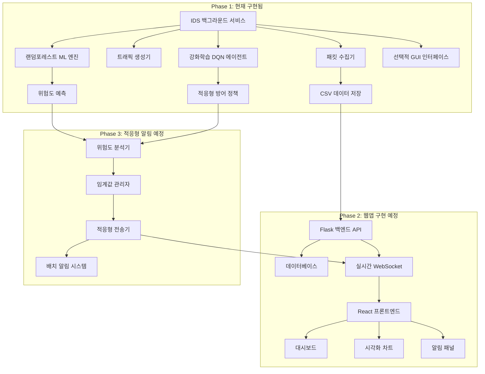

#  IDS 통합 모니터링 시스템 설계서

## **프로젝트 개요**

### **목표**
기존 IDS 프로그램을 확장하여 웹 기반 실시간 모니터링 및 적응형 위협 알림 시스템 구축

### **핵심 기능**
- ✅ **완료**: 패킷 수집, ML 분석, 강화학습 기반 IDS 시스템
- 🔄 **진행 예정**: 웹 기반 시각화 대시보드
- 🔄 **진행 예정**: 위험도별 적응형 알림 시스템

---

##  **시스템 아키텍처**



---

##  **단계별 구현 계획**

### **Phase 1: 현재 상태 (완료)** ✅

| 항목 | 상태 | 설명 |
|------|------|------|
| **패킷 수집** | ✅ 완료 | Scapy 기반 실시간 패킷 캡처 |
| **트래픽 생성** | ✅ 완료 | 다양한 공격 시뮬레이션 |
| **랜덤포레스트 ML** | ✅ 완료 | 위험도 예측 및 분류 |
| **강화학습 DQN** | ✅ 완료 | 적응형 방어 정책 학습 |
| **백그라운드 서비스** | ✅ 완료 | 시스템 서비스로 운영 |
| **선택적 GUI** | ✅ 완료 | 필요시에만 표시되는 관리 인터페이스 |
| **데이터 저장** | ✅ 완료 | CSV 형태 로컬 저장 |

**기술 스택**: Python, Scapy, scikit-learn, PyTorch, PyQt6(선택적), pandas

**강화학습 구현 세부사항**:
```python
# DQN 에이전트 구조 (IDSAgent_RL.py 기반)
class DQNAgent:
    - 상태 공간: 네트워크 특성 벡터
    - 행동 공간: 방어 정책 선택
    - 보상 함수: 위협 차단 성공률
    - 모드별 최적화: lightweight/performance
```

---

### **Phase 2: 웹 대시보드 구현** 🔄

#### **2.1 백엔드 개발**

**구현 내용**
```python
# Flask API 구조
/api/packets/          # 패킷 데이터 조회
/api/analysis/         # ML 분석 결과 조회  
/api/threats/          # 위협 정보 조회
/api/rl-status/        # 강화학습 상태 조회
/api/statistics/       # 통계 데이터
/ws/realtime          # WebSocket 연결
```

| 구성요소 | 구현 난이도 | 예상 시간 | 비용 | 기대효과 |
|----------|-------------|-----------|------|----------|
| **Flask API 서버** | ⭐⭐ 보통 | 1주 | 무료 | API 기반 데이터 접근 |
| **데이터베이스 연동** | ⭐⭐ 보통 | 3일 | 무료 (SQLite/PostgreSQL) | 구조화된 데이터 관리 |
| **WebSocket 실시간 통신** | ⭐⭐⭐ 어려움 | 1주 | 무료 | 실시간 데이터 스트리밍 |
| **IDS↔Flask 연동** | ⭐⭐ 보통 | 3일 | 무료 | 기존 시스템과 통합 |
| **강화학습 모니터링 API** | ⭐⭐⭐ 어려움 | 4일 | 무료 | RL 에이전트 상태 추적 |

**총 예상 시간**: **3주**  
**총 비용**: **무료** (오픈소스 기술 스택)

#### **2.2 프론트엔드 개발**

**구현 내용**
```javascript
// React 컴포넌트 구조
- NetworkTopology      // 네트워크 연결 시각화
- TrafficMonitor       // 실시간 트래픽 차트
- ThreatDashboard      // 위험도 대시보드
- PacketAnalyzer       // 패킷 상세 분석
- RLAgentStatus        // 강화학습 에이전트 상태
- AlertHistory         // 알림 이력 관리
- DefensePolicy        // 방어 정책 시각화
```

| 구성요소 | 구현 난이도 | 예상 시간 | 비용 | 기대효과 |
|----------|-------------|-----------|------|----------|
| **React 기본 구조** | ⭐⭐ 보통 | 1주 | 무료 | 모던 웹 UI 프레임워크 |
| **실시간 차트 시각화** | ⭐⭐⭐ 어려움 | 1.5주 | 무료 (Chart.js/D3.js) | 직관적 데이터 시각화 |
| **네트워크 토폴로지** | ⭐⭐⭐⭐ 매우 어려움 | 2주 | 무료 (react-force-graph) | 네트워크 관계 시각화 |
| **강화학습 모니터링 UI** | ⭐⭐⭐ 어려움 | 1주 | 무료 | RL 에이전트 학습 상태 표시 |
| **반응형 대시보드** | ⭐⭐⭐ 어려움 | 1주 | 무료 (Material-UI) | 데스크톱/태블릿 호환 |
| **WebSocket 클라이언트** | ⭐⭐ 보통 | 3일 | 무료 | 실시간 데이터 수신 |

**총 예상 시간**: **6.5주**  
**총 비용**: **무료**

**Phase 2 총 예상 시간**: **9.5주**

---

### **Phase 3: 적응형 알림 시스템** 🔄

#### **3.1 위험도 분석 엔진**

**구현 내용**
```python
# 적응형 알림 시스템 구조
class AdaptiveAlertManager:
    - 위험도별 임계값 관리
    - 패킷 누적 카운터
    - 시간 기반 배치 전송
    - 공격 패턴 탐지
    - 강화학습 기반 적응형 정책
```

| 구성요소 | 구현 난이도 | 예상 시간 | 비용 | 기대효과 |
|----------|-------------|-----------|------|----------|
| **위험도 분류 엔진** | ⭐⭐⭐ 어려움 | 1주 | 무료 | 지능형 위협 분류 |
| **임계값 관리 시스템** | ⭐⭐ 보통 | 4일 | 무료 | 설정 가능한 알림 조건 |
| **배치 전송 로직** | ⭐⭐⭐ 어려움 | 1주 | 무료 | 효율적 데이터 전송 |
| **공격 패턴 탐지** | ⭐⭐⭐⭐ 매우 어려움 | 2주 | 무료 | 고급 위협 인텔리전스 |
| **RL 기반 적응형 정책** | ⭐⭐⭐⭐ 매우 어려움 | 1.5주 | 무료 | 학습 기반 자동 조정 |

#### **3.2 실시간 알림 UI**

**구현 내용**
```javascript
// 적응형 알림 UI 컴포넌트
- CriticalAlertModal   // 긴급 알림 팝업
- ThreatCounter        // 위험도별 카운터
- AlertHistory         // 알림 이력
- ThreatHeatmap        // 위협 히트맵
- PolicyDashboard      // 방어 정책 대시보드
```

| 구성요소 | 구현 난이도 | 예상 시간 | 비용 | 기대효과 |
|----------|-------------|-----------|------|----------|
| **다단계 알림 UI** | ⭐⭐⭐ 어려움 | 1주 | 무료 | 위험도별 차별화된 알림 |
| **사운드 알림 시스템** | ⭐⭐ 보통 | 2일 | 무료 | 청각적 긴급 알림 |
| **알림 설정 패널** | ⭐⭐ 보통 | 4일 | 무료 | 사용자 맞춤 설정 |
| **정책 시각화 대시보드** | ⭐⭐⭐ 어려움 | 1주 | 무료 | 방어 정책 상태 표시 |

**Phase 3 총 예상 시간**: **7주**  
**총 비용**: **무료**

---

##  **비용 분석**

### **개발 비용**
| 항목 | 비용 | 설명 |
|------|------|------|
| **인력 비용** | 무료 | 개인 프로젝트 |
| **소프트웨어 라이선스** | 무료 | 오픈소스 기술 스택 |
| **클라우드 호스팅** | $5-20/월 | AWS/Vercel (선택사항) |
| **도메인** | $10/년 | .com 도메인 (선택사항) |

### **운영 비용 (월간)**
- **최소 구성**: $0 (로컬 호스팅)
- **기본 구성**: $5-10/월 (클라우드 호스팅)
- **프로덕션**: $30-50/월 (고성능 서버 + 백업)

---

##  **개발 일정**

### **전체 타임라인: 16.5주 (약 4개월)**

```gantt
gantt
    title IDS 웹 시스템 개발 일정
    dateFormat  X
    axisFormat %s주
    
    section Phase 1
    기존 IDS 시스템 : done, phase1, 0, 1w
    
    section Phase 2
    Flask 백엔드 : phase2a, 1w, 4w
    React 프론트엔드 : phase2b, 2w, 8.5w
    RL 모니터링 연동 : phase2c, 7w, 9w
    통합 테스트 : phase2d, 9w, 10.5w
    
    section Phase 3
    적응형 알림 백엔드 : phase3a, 10.5w, 15w
    알림 UI 개발 : phase3b, 13w, 16w
    최종 통합 : phase3c, 16w, 16.5w
```

### **주차별 세부 계획**

**Week 1-4**: Flask 백엔드 개발
- API 설계 및 구현
- 데이터베이스 스키마 설계
- IDS 연동 모듈 개발
- 강화학습 모니터링 API 구현

**Week 2-8.5**: React 프론트엔드 개발
- 기본 컴포넌트 구조 설계
- 실시간 차트 시각화 구현
- 네트워크 토폴로지 시각화
- RL 에이전트 상태 모니터링 UI

**Week 10.5-15**: 적응형 알림 시스템
- 위험도 분석 엔진 개발
- 배치 전송 로직 구현
- 공격 패턴 탐지 알고리즘
- RL 기반 적응형 정책 구현

**Week 13-16.5**: 알림 UI 및 통합
- 다단계 알림 인터페이스
- 정책 시각화 대시보드
- 전체 시스템 통합 테스트

---

##  **강화학습 시스템 세부사항**

### **DQN 에이전트 구조**
```python
# 강화학습 환경 정의 (IDSAgent_RL.py 기반)
class NetworkEnv:
    - 상태: [패킷_속도, 위험도_점수, 연결_수, 프로토콜_분포]
    - 행동: [차단, 허용, 경고, 정밀검사]
    - 보상: 위협차단성공(+10), 오탐(−5), 놓친위협(−20)
    
class DQNAgent:
    - 네트워크: 3층 신경망 (64-128-64 노드)
    - 학습률: 0.001
    - 경험재생: 10,000 샘플 버퍼
    - 모드별 최적화: lightweight/performance
```

### **학습 프로세스**
| 단계 | 설명 | 예상 시간 |
|------|------|----------|
| **초기 학습** | 기본 패킷 데이터로 사전 훈련 | 2시간 |
| **온라인 학습** | 실시간 패킷으로 지속적 학습 | 지속적 |
| **정책 업데이트** | 1시간마다 모델 가중치 업데이트 | 자동 |
| **성능 평가** | 일일 정확도 및 오탐률 측정 | 자동 |

---

##  **기대 효과**

### **기술적 효과**

- 🛡 **보안 강화**: 실시간 위협 탐지 및 대응
- 🧠 **지능형 방어**: 강화학습 기반 적응형 정책
- 📊 **시각화**: 직관적인 네트워크 상태 파악
- 🔧 **확장성**: 모듈형 구조로 기능 확장 용이

### **사용자 경험**
- 🖥 **접근성**: 웹 인터페이스로 원격 모니터링
- ⏰ **실시간성**: 긴급 상황 즉시 알림
- 🎨 **직관성**: 시각적 대시보드로 쉬운 상황 파악
- ⚙️ **커스터마이징**: 사용자별 알림 설정
- 🔍 **백그라운드 운영**: 필요시에만 GUI 표시

### **운영 효율성**
- 💰 **비용 절약**: 오픈소스 기반 저비용 구축
- 🚀 **빠른 대응**: 자동화된 위협 탐지
- 📈 **확장 가능**: 클라우드 스케일링 지원
- 🔍 **분석 향상**: 히스토리 데이터 기반 패턴 분석
- 🤖 **자동 최적화**: RL 기반 정책 자동 조정

---

##  **기술 스택 요약**

### **백엔드**
- **언어**: Python 3.8+
- **프레임워크**: Flask, Flask-SocketIO
- **데이터베이스**: PostgreSQL / SQLite
- **ML**: scikit-learn, pandas, numpy
- **강화학습**: PyTorch, Gym
- **네트워킹**: Scapy

### **프론트엔드**
- **언어**: TypeScript
- **프레임워크**: React 18+
- **UI 라이브러리**: Material-UI
- **차트**: Chart.js, D3.js, react-force-graph
- **실시간 통신**: Socket.IO Client

### **시스템 서비스**
- **백그라운드 서비스**: Python 데몬
- **선택적 GUI**: PyQt6 (관리용)
- **배포**: Docker, Nginx
- **클라우드**: AWS / Vercel (선택사항)

---

##  **위험 요소 및 대응책**

### **기술적 위험**
| 위험 요소 | 확률 | 대응책 |
|-----------|------|--------|
| **WebSocket 연결 불안정** | 중간 | 자동 재연결 로직 구현 |
| **대용량 데이터 처리** | 높음 | 배치 처리 및 페이징 구현 |
| **RL 모델 수렴 실패** | 중간 | 하이퍼파라미터 자동 튜닝 |
| **브라우저 호환성** | 낮음 | 모던 브라우저 타겟팅 |

### **일정 위험**
| 위험 요소 | 확률 | 대응책 |
|-----------|------|--------|
| **프론트엔드 개발 지연** | 중간 | 단계별 MVP 접근 |
| **알림 시스템 복잡도** | 높음 | 단순 버전부터 점진적 개발 |
| **RL 시스템 통합 복잡도** | 높음 | 기존 모델 우선 사용 |

---

##  **MVP (최소 기능 제품) 우선순위**

### **1순위: 기본 웹 대시보드** (Week 1-10.5)
- Flask API + React 기본 구조
- 패킷 데이터 조회 및 시각화
- 간단한 실시간 업데이트
- RL 에이전트 상태 모니터링

### **2순위: 실시간 알림** (Week 10.5-15)
- 위험도별 기본 알림
- WebSocket 실시간 통신
- 긴급 상황 즉시 알림
- 적응형 임계값 시스템

### **3순위: 고급 기능** (Week 15-16.5)
- 공격 패턴 탐지
- RL 기반 정책 최적화
- 통합 대시보드 완성

---