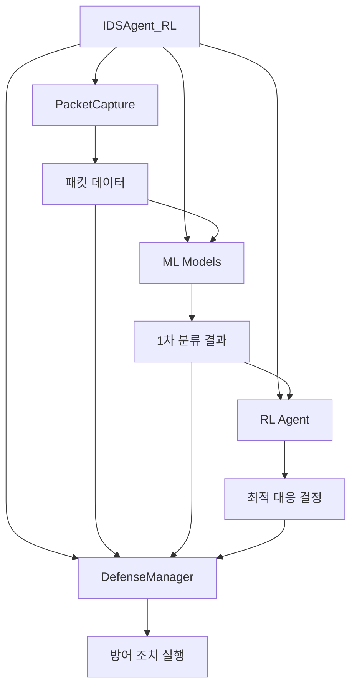

# 파이썬 코드 구조

이 문서는 반응형 취약점 차단 AI 에이전트의 파이썬 코드 구조를 설명합니다.

## 핵심 모듈

### 1. IDSAgent_RL.py (메인 에이전트)

메인 에이전트는 시스템의 중앙 제어 모듈입니다.

```
- 주요 기능:
  - 시스템 초기화 및 설정 관리
  - 패킷 캡처 모듈과 방어 메커니즘 통합
  - 사용자 인터페이스 제공
  - 모드 전환 관리 (경량/고성능)
```

### 2. modules/defense_mechanism.py (방어 메커니즘)

시스템의 핵심 방어 기능을 구현합니다.

```
- 주요 클래스:
  - DefenseManager: 방어 메커니즘 통합 관리
  - AutoDefenseActions: 위협 수준별 자동 대응 조치 실행
  - BlockMaliciousTraffic: IP 차단 기능
  - AlertSystem: 알림 시스템

- 위협 수준별 대응:
  - 높은 위협 (신뢰도 0.9 이상): IP 영구 차단, 긴급 알림
  - 중간 위협 (신뢰도 0.8 이상): IP 임시 차단(30분), 표준 알림
  - 낮은 위협 (신뢰도 0.7 이상): 모니터링 강화, 로깅 강화
```

### 3. modules/packet_capture.py (패킷 캡처)

네트워크 패킷을 캡처하고 분석하는 기능을 제공합니다.

```
- 주요 클래스:
  - PacketCaptureCore: 패킷 캡처 핵심 로직
  - PacketCapture: 사용자 인터페이스 제공

- 주요 기능:
  - 실시간 패킷 캡처
  - 패킷 구문 분석 및 특성 추출
  - 패킷 데이터 전처리
```

### 4. modules/ml_models.py (머신러닝 모델)

랜덤 포레스트 기반 침입 탐지 모델을 구현합니다.

```
- 주요 기능:
  - 랜덤 포레스트 모델 학습
  - 특성 중요도 분석
  - 모델 평가 및 시각화
  - 예측 결과 통합
```

### 5. modules/reinforcement_learning.py (강화학습)

강화학습을 통한 최적 대응 정책 학습을 구현합니다.

```
- 주요 클래스:
  - NetworkEnv: 강화학습 환경
  - DQNAgent: DQN 알고리즘 기반 에이전트

- 주요 기능:
  - 랜덤 포레스트 예측 결과와 통합
  - 상태-행동-보상 체계 구현
  - 에이전트 학습 및 평가
```

## 모듈 간 통합 구조



## C로 전환 가능한 컴포넌트

1. **패킷 캡처 및 분석 모듈**
   - 메모리 사용량이 크고 실시간 성능이 중요한 부분
   - `packet_capture.py`의 핵심 함수들

2. **방어 메커니즘 실행 부분**
   - 시간 민감성이 높은 방어 조치 실행 로직
   - `defense_mechanism.py`의 `BlockMaliciousTraffic` 클래스

3. **패킷 전처리 파이프라인**
   - 데이터 집약적인 전처리 작업
   - 특성 추출 및 변환 로직 