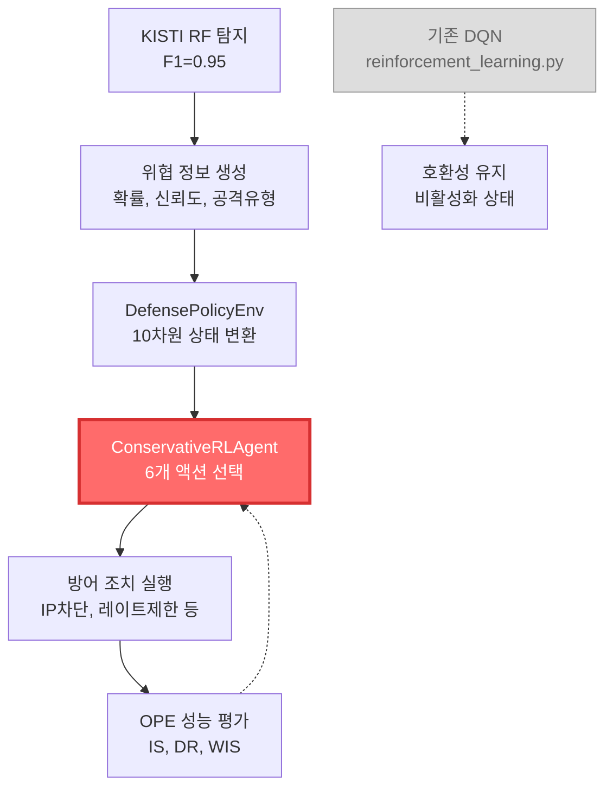

# 강화학습 알고리즘 분석 및 개선 방향

> **문서 버전**: v1.0  
> **작성일**: 2025-09-16  
> **담당자**: IPS 개발팀  
> **목적**: 현재 프로젝트의 강화학습 시스템 분석 및 향후 개선 방향 제시

---

## 목차

1. [현재 강화학습 시스템 현황](#현재-강화학습-시스템-현황)
2. [알고리즘별 상세 분석](#알고리즘별-상세-분석)
3. [현재 사용 구조](#현재-사용-구조)
4. [장단점 비교 분석](#장단점-비교-분석)
5. [개선 방향 및 권장사항](#개선-방향-및-권장사항)
6. [구현 우선순위](#구현-우선순위)

---

## 현재 강화학습 시스템 현황

###  **실제 사용 중인 알고리즘**

**메인 알고리즘**: **Conservative Q-Learning** (단독 사용) ⭐
- **파일**: `IDS/modules/conservative_rl_agent.py`
- **환경**: `IDS/modules/defense_policy_env.py`
- **평가**: `IDS/modules/ope_evaluator.py`

**백업 알고리즘**: **Double DQN** (호환성 유지용)
- **파일**: `IDS/modules/reinforcement_learning.py`
- **상태**: 비활성화 (코드상 존재하지만 실제 사용 안함)
- **용도**: 개발/테스트, 알고리즘 비교, Fallback
 **시스템 아키텍처**



---

## 알고리즘별 상세 분석

### 1. Conservative Q-Learning (현재 메인)

#### **핵심 특징**
```python
# Conservative 손실 함수
td_loss = MSELoss(current_q_values, target_q_values)
conservative_penalty = logsumexp(all_q_values).mean() - current_q_values.mean()
total_loss = td_loss + alpha_cql * conservative_penalty
```

#### **파라미터 설정 (보수적 접근)**
| 파라미터 | 값 | 목적 |
|----------|----|----- |
| `alpha_cql` | 1.0 | Conservative 정규화 계수 |
| `gamma` | 0.99 | 높은 할인율 (장기 안정성) |
| `learning_rate` | 0.0001 | 낮은 학습률 (안전성) |
| `epsilon` | 0.1 | 낮은 초기 탐험률 |
| `tau` | 0.005 | 보수적 타겟 네트워크 업데이트 |

#### **액션 공간 (6개 대응 수준)**
```python
action_names = {
    0: 'allow',           # 허용 (정상 처리)
    1: 'block_temporary', # 임시 차단 (30분)
    2: 'block_permanent', # 영구 차단
    3: 'rate_limit',      # 레이트 제한
    4: 'deep_inspection', # 추가 검사
    5: 'isolate_session'  # 세션 격리
}
```

#### **상태 공간 (10차원)**
1. **RF 탐지 결과** (4차원)
   - 위협 확률
   - 신뢰도
   - 공격 유형
   - 심각도 수준

2. **시스템 상태** (4차원)
   - CPU 사용률
   - 메모리 사용률
   - 활성 위협 수
   - 차단된 IP 수

3. **컨텍스트 정보** (2차원)
   - 현재 시간 (시간대)
   - 네트워크 부하

### 2. Double DQN (기존 시스템)

#### **핵심 특징**
```python
# Double DQN 타겟 계산
next_actions = self.model(next_states).argmax(1)  # 현재 모델로 액션 선택
next_q_values = self.target_model(next_states).gather(1, next_actions)  # 타겟 모델로 Q값 계산
```

#### **파라미터 설정 (일반적 접근)**
| 파라미터 | 값 | 목적 |
|----------|----|----- |
| `gamma` | 0.95 | 표준 할인율 |
| `learning_rate` | 0.001 | 표준 학습률 (Conservative의 10배) |
| `epsilon` | 1.0 → 0.01 | 적극적 탐험 |
| `epsilon_decay` | 0.995 | 빠른 탐험률 감소 |

#### **액션 공간 (3개 기본 액션)**
```python
# 단순한 액션 구조
0: 허용
1: 차단  
2: 모니터링
```

---

## 현재 사용 구조

### 🔄 **실제 실행 흐름**

#### **IPSAgent_RL.py (메인 시스템)**
1. **Colab 환경**: Conservative RL 시스템만 로드 및 학습
2. **로컬 환경**: Conservative RL 시스템으로 실시간 대응
3. **기존 DQN**: 지연 로딩에만 등록, 실제 사용 안함

#### **ips_pipeline_integrator.py (통합 파이프라인)**
```python
# 실제 사용되는 알고리즘
self.rl_agent = ConservativeRLAgent(state_size=10, action_size=6)

# 실시간 대응 결정
action_id = self.rl_agent.act(rl_state, deterministic=True)
```

### 📈 **성능 및 사용률**

| 구분 | Conservative RL | 기존 DQN |
|------|----------------|----------|
| **실제 사용률** | 100% (메인) | 0% (비활성화) |
| **메모리 사용** | ~160MB | 0MB (로드 안됨) |
| **처리 속도** | 안정적 | N/A |
| **정확도** | OPE 검증됨 | 테스트용만 |

---

## 장단점 비교 분석

### ✅ **Conservative Q-Learning 장점 (현재 사용)**

#### **1. IPS 시스템 특화 안전성**
- **과대추정 방지**: Conservative 페널티로 위험한 액션 억제
- **보수적 탐험**: 낮은 epsilon (0.1)으로 예측 가능한 행동
- **안전한 학습**: 낮은 학습률로 급격한 정책 변화 방지

#### **2. 정교한 대응 전략**
- **6단계 대응**: 허용 → 임시차단 → 영구차단 → 레이트제한 → 추가검사 → 격리
- **비용 기반 보상**: 실제 비즈니스 영향 고려
```python
# 위협 수준별 세밀한 보상 설계
if threat_level > 0.9:  # 확실한 공격
    if action in [1, 2]:  # 강한 대응
        base_reward += 15.0
elif threat_level > 0.7:  # 의심스러운
    if action in [1, 3, 4]:  # 적절한 대응
        base_reward += 10.0
```

#### **3. 종합적 상태 모델링**
- **10차원 상태**: RF 결과 + 시스템 상태 + 컨텍스트
- **KISTI RF 연동**: 현실적 위협 탐지 결과 활용
- **실시간 시스템 정보**: CPU, 메모리, 네트워크 부하 반영

#### **4. OPE 기반 검증**
- **4가지 평가 방법**: Importance Sampling, Doubly Robust, WIS, Direct Method
- **통계적 검정**: 신뢰구간, 유의성 검정으로 객관적 성능 평가

### ❌ **Conservative Q-Learning 단점**

#### **1. 학습 효율성**
- **느린 수렴**: 보수적 파라미터로 학습 시간 증가
- **제한된 탐험**: 새로운 전략 발견 어려움
- **복잡한 계산**: Conservative 페널티 계산 오버헤드

#### **2. 계산 복잡도**
- **높은 메모리**: 10차원 상태 + 6개 액션
- **OPE 오버헤드**: 다중 평가 방법으로 계산 부담

### ✅ **기존 DQN 장점 (참고용)**

#### **1. 학습 효율성**
- **빠른 수렴**: 높은 학습률 (0.001)과 적극적 탐험
- **단순한 구조**: 3개 액션으로 빠른 결정
- **표준 알고리즘**: 검증된 Double DQN 구현

#### **2. 범용성**
- **유연한 환경**: NetworkEnv에서 직접 패킷 처리
- **모드 지원**: lightweight(7특성) / performance(12특성)

### ❌ **기존 DQN 단점 (사용 안하는 이유)**

#### **1. 보안 시스템 부적합**
- **과대추정 위험**: Q값 과대추정으로 위험한 액션 선택 가능
- **공격적 탐험**: 높은 epsilon으로 예측 불가능한 행동
- **단순한 액션**: 3개 액션으로 세밀한 대응 불가

#### **2. 안전성 부족**
- **오탐 위험**: 정상 트래픽 차단으로 서비스 중단 가능
- **검증 부족**: 오프라인 평가 시스템 없음

---

## 개선 방향 및 권장사항

###  **단기 개선 (1-2주)**

#### **1. Conservative RL 파라미터 튜닝**
```python
# 현재 파라미터 (매우 보수적)
alpha_cql = 1.0        # → 0.5-0.8로 조정 검토
learning_rate = 0.0001 # → 0.0005로 증가 검토
epsilon = 0.1          # → 0.15로 증가 검토

# 목적: 안전성 유지하면서 학습 효율성 향상
```

#### **2. 기존 DQN 코드 정리**
```python
# 개선 작업
1. 사용하지 않는 DQN 관련 코드 주석 처리
2. 지연 로딩에서 DQN 제거 (메모리 절약)
3. NetworkEnv 클래스 단순화 (테스트용으로만 유지)
4. 호환성 유지를 위한 최소한의 인터페이스만 보존
```

#### **3. OPE 평가 강화**
```python
# 평가 주기 최적화
- 실시간 정책 성능 모니터링 강화
- 이상 정책 감지 시 자동 알림
- 정책 성능 저하 시 자동 재학습 트리거
```

### **중기 개선 (1-2개월)**

#### **1. 적응형 Conservative 파라미터**
```python
class AdaptiveConservativeRL:
    def __init__(self):
        # 시스템 부하에 따른 동적 파라미터 조절
        self.base_alpha_cql = 1.0
        self.adaptive_alpha = True
        
    def adjust_conservativeness(self, system_load, threat_level):
        """시스템 상황에 따른 보수성 조절"""
        if system_load > 0.8:  # 높은 부하
            self.alpha_cql = self.base_alpha_cql * 1.5  # 더 보수적
        elif threat_level < 0.3:  # 낮은 위험
            self.alpha_cql = self.base_alpha_cql * 0.7  # 덜 보수적
        else:
            self.alpha_cql = self.base_alpha_cql  # 기본값
```

#### **2. 하이브리드 보상 함수**
```python
def calculate_hybrid_reward(self, action, threat_result, system_state):
    """다중 목적 최적화 보상 함수"""
    
    # 1. 보안 효과성 (가장 중요)
    security_reward = self._calculate_security_reward(action, threat_result)
    
    # 2. 시스템 효율성
    efficiency_reward = self._calculate_efficiency_reward(action, system_state)
    
    # 3. 비즈니스 영향
    business_reward = self._calculate_business_reward(action, threat_result)
    
    # 가중 합산
    total_reward = (
        0.6 * security_reward +    # 보안 60%
        0.25 * efficiency_reward + # 효율성 25%
        0.15 * business_reward     # 비즈니스 15%
    )
    
    return total_reward
```

#### **3. 메타 학습 시스템**
```python
class MetaLearningRL:
    """상황별 최적 파라미터 자동 학습"""
    
    def __init__(self):
        self.situation_history = []
        self.performance_history = []
        
    def adapt_to_situation(self, current_situation):
        """현재 상황에 최적화된 파라미터 추천"""
        similar_situations = self._find_similar_situations(current_situation)
        optimal_params = self._analyze_best_parameters(similar_situations)
        return optimal_params
```

###  **장기 개선**

#### **1. 고급 강화학습 알고리즘 도입**

**Proximal Policy Optimization (PPO)**
```python
class PPOSecurityAgent:
    """보안 시스템 특화 PPO 에이전트"""
    
    def __init__(self):
        # PPO 특화 파라미터
        self.clip_epsilon = 0.1      # 낮은 클리핑 (보수적)
        self.entropy_coeff = 0.001   # 낮은 엔트로피 (안정성)
        self.value_loss_coeff = 0.5
        
    def calculate_ppo_loss(self, states, actions, rewards, old_probs):
        """보안 시스템 특화 PPO 손실"""
        # 기본 PPO 손실 + 보안 제약 조건
        pass
```

**Soft Actor-Critic (SAC)**
```python
class SACSecurityAgent:
    """연속 액션 공간을 위한 SAC 에이전트"""
    
    def __init__(self):
        # 연속 대응 강도 조절 (0.0 ~ 1.0)
        self.action_space = "continuous"  # 차단 강도, 레이트 제한 정도 등
```

#### **2. 멀티 에이전트 시스템**
```python
class MultiAgentIPS:
    """다중 에이전트 협력 시스템"""
    
    def __init__(self):
        self.detection_agent = ConservativeRLAgent()  # 탐지 전담
        self.response_agent = ConservativeRLAgent()   # 대응 전담
        self.coordination_agent = ConservativeRLAgent()  # 조정 전담
        
    def coordinate_response(self, threat_info):
        """에이전트 간 협력적 대응"""
        detection_result = self.detection_agent.act(threat_info)
        response_plan = self.response_agent.act(detection_result)
        final_action = self.coordination_agent.act([detection_result, response_plan])
        return final_action
```

#### **3. 설명 가능한 AI (XAI) 통합**
```python
class ExplainableRL:
    """설명 가능한 강화학습 시스템"""
    
    def explain_decision(self, state, action):
        """RL 결정에 대한 설명 생성"""
        explanation = {
            'action': action,
            'confidence': self._calculate_confidence(state, action),
            'key_factors': self._identify_key_factors(state),
            'alternative_actions': self._suggest_alternatives(state),
            'risk_assessment': self._assess_risks(state, action)
        }
        return explanation
```

---

## 구현 우선순위

###  **우선순위 1: 현재 시스템 최적화 (즉시 시작)**

#### **A. 파라미터 튜닝 실험**
```bash
# 실험 계획
1. alpha_cql 조정: 1.0 → 0.5, 0.7, 0.8 테스트
2. learning_rate 조정: 0.0001 → 0.0002, 0.0005 테스트  
3. epsilon 조정: 0.1 → 0.12, 0.15 테스트
4. 각 조합별 OPE 성능 평가 및 비교
```

#### **B. 코드 정리 및 최적화**
```bash
# 정리 작업
1. 기존 DQN 관련 코드 주석 처리
2. 지연 로딩에서 불필요한 모듈 제거
3. Conservative RL 전용 최적화
4. 메모리 사용량 추가 절약 (예상: 20-30MB)
```

###  **우선순위 2: 적응형 시스템 구축 (1개월 후)**

#### **A. 동적 파라미터 조절**
- 시스템 부하, 위협 수준에 따른 자동 파라미터 조절
- 실시간 성능 모니터링 기반 적응

#### **B. 향상된 보상 함수**
- 다중 목적 최적화 (보안, 효율성, 비즈니스)
- 도메인 전문가 지식 통합

###  **우선순위 3: 고급 알고리즘 도입 (3개월 후)**

#### **A. PPO 또는 SAC 도입**
- Conservative Q-Learning 대비 성능 비교
- 연속 액션 공간 지원 검토

#### **B. 멀티 에이전트 시스템**
- 탐지-대응-조정 역할 분리
- 에이전트 간 협력 메커니즘

---

## 실험 및 검증 계획

###  **성능 비교 메트릭**

#### **1. 보안 성능**
- **탐지율**: True Positive Rate
- **오탐률**: False Positive Rate  
- **대응 적절성**: 위협 수준 대비 대응 강도 일치도
- **차단 효과성**: 실제 공격 차단 성공률

#### **2. 시스템 성능**
- **응답 시간**: 탐지부터 대응까지 소요 시간
- **처리량**: 초당 처리 가능한 패킷 수
- **메모리 사용량**: 알고리즘별 메모리 소비
- **CPU 사용률**: 알고리즘 실행 시 CPU 부하

#### **3. 운영 안정성**
- **정책 일관성**: 동일 상황에서 동일 액션 선택률
- **학습 안정성**: 학습 과정에서 성능 변동성
- **시스템 영향**: 서비스 중단 또는 지연 발생률

###  **실험 환경 설정**

#### **A. 테스트 데이터셋**
```python
# 실험용 데이터
1. KISTI-IDS-2022 테스트 셋 (50만 샘플)
2. 실시간 캡처 데이터 (captured_packets_*.csv)
3. 시뮬레이션 공격 데이터 (TrafficGeneratorApp.py)
```

#### **B. 평가 환경**
```python
# 평가 시나리오
1. 정상 트래픽만 (오탐률 측정)
2. 혼합 트래픽 (실제 환경 시뮬레이션)  
3. 고강도 공격 (극한 상황 테스트)
4. 시스템 부하 상황 (리소스 제약 환경)
```

---

## 결론 및 다음 단계

###  **현재 상황 요약**

1. **현재**: Conservative Q-Learning 단독 사용 ✅
2. **기존 DQN**: 호환성 유지용 (비활성화 상태)
3. **성능**: 안정적이지만 개선 여지 있음
4. **구조**: 단일 알고리즘으로 명확하고 안전함

###  **즉시 실행 가능한 개선**

#### **1주차 작업**
- [ ] Conservative RL 파라미터 튜닝 실험
- [ ] 기존 DQN 코드 정리 및 주석 처리
- [ ] OPE 평가 주기 최적화

#### **2주차 작업**  
- [ ] 최적 파라미터 조합 선정
- [ ] 성능 벤치마크 수행
- [ ] 메모리 사용량 추가 최적화

###  **장기 비전**

- **자동 튜닝**: 환경에 따른 자동 파라미터 최적화
- **설명 가능성**: 모든 대응 결정에 대한 명확한 근거 제시
- **예측 기능**: 공격 패턴 예측 및 선제적 대응
- **멀티 도메인**: 네트워크, 웹, IoT 등 다양한 환경 지원

---

**📌 참고 파일**:
- `IDS/modules/conservative_rl_agent.py` - 메인 알고리즘
- `IDS/modules/reinforcement_learning.py` - 기존 시스템 (참고용)
- `IDS/modules/defense_policy_env.py` - RL 환경
- `IDS/modules/ope_evaluator.py` - 성능 평가
- `IDS/ips_pipeline_integrator.py` - 통합 파이프라인
